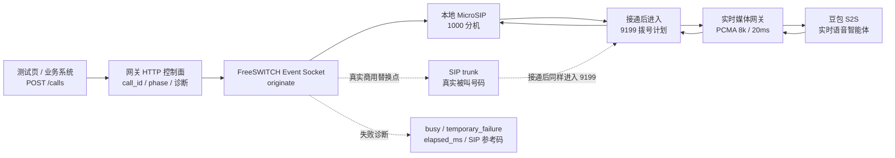

# SIP Realtime Voice Gateway

独立的 SIP 实时语音网关项目。

后续目标是建设商用电话智能客服主链路：

```text
SIP Trunk / MicroSIP
  -> FreeSWITCH
  -> sip-realtime-voice-gateway
  -> 端到端实时语音模型
  -> sip-realtime-voice-gateway
  -> FreeSWITCH
  -> 电话用户
```

主方案文档见：

```text
static/pages/handoff.html
static/pages/agent-readme.html
```

## 当前定位

本项目不依赖 TEN 框架，不把旧 ASR -> LLM -> TTS 级联链路作为运行时回退。

职责边界：

- FreeSWITCH 负责 SIP 信令、RTP、PCMA 协商和运营商接入。
- 本项目负责实时模型会话、电话音频格式转换、播放引擎、打断控制、会话状态和指标。
- 真实 SIP Trunk 接入时，MicroSIP 只会被替换为运营商线路，FreeSWITCH 到本项目的媒体契约应保持稳定。

## 当前代码状态

当前主线已完成 P1、P2、P3 的代码验证：

```text
P1：媒体契约固定为 PCMA / 8k / mono / 20ms。
P2：Playout Engine 可把 24k 模型 PCM 转为 8k / 20ms / 320 bytes 电话帧。
P3：FreeSWITCH Event Socket 适配可解析播放事件，并在插话时执行 uuid_audio_stream <uuid> break。
```

当前运行时主线已收敛为豆包 S2S：

- 本地 WebSocket 媒体服务。
- Echo 测试。
- PCM 重采样和 PCMA 编解码工具。
- 豆包 S2S 端到端实时语音客户端、探针和电话媒体适配。
- Server VAD、Playout Engine、打断控制、尾部 drain 和会话状态托管。

阿里 Realtime 和火山硬件智能体试验线已经完成调研价值，不再作为运行时回退，也不再保留生产代码入口。后续目标不是兼容所有历史阶段，而是收敛到主方案里的商用实时媒体内核：

```text
FreeSWITCH 电话边界
  -> Gateway 会话状态机
  -> Doubao S2S Realtime Client
  -> Playout Engine
  -> Barge-in Controller
  -> Observability
```

## 本地启动

首次启动前先创建本项目自己的本地环境文件：

```powershell
Copy-Item .env.example .env
```

然后把 `.env` 中的豆包凭证和本地 FreeSWITCH Event Socket 密码改为实际值。`.env` 已被本项目 `.gitignore` 忽略，不应提交。

```powershell
python -m app.main --config configs/local.example.toml
```

健康检查：

```powershell
Invoke-RestMethod http://127.0.0.1:9100/health
```

HTTP 外呼控制面本地验证：

浏览器测试页：

```text
http://127.0.0.1:9100/outbound-test
```

HTML 页面入口：

```text
http://127.0.0.1:9100/docs/handoff
http://127.0.0.1:9100/docs/notes
http://127.0.0.1:9100/docs/mac-softphone
http://127.0.0.1:9100/docs/agent-readme
```

当前本地测试链路：



`MicroSIP 1000` 是本地验证替身；真实商用外呼会在 FreeSWITCH endpoint 层替换成 SIP trunk 或企业中继号码，接通后的 `9199 -> 实时媒体网关 -> 豆包 S2S` 链路保持一致。

接口命令：

```powershell
Invoke-RestMethod `
  -Method Post `
  -Uri http://127.0.0.1:9100/calls `
  -ContentType "application/json" `
  -Body (@{
    destination = "1000"
    external_call_id = "local-test-001"
    caller_id_number = "9000"
  } | ConvertTo-Json)

Invoke-RestMethod http://127.0.0.1:9100/calls
```

本地默认会先把 `destination=1000` 渲染成 FreeSWITCH 注册查询，主叫号码使用 `9000`，避免在 MicroSIP 上出现 `1000` 呼叫 `1000` 的自呼叫歧义：

```text
sofia_contact:*/1000
```

网关会调用 Event Socket 执行 `sofia_contact */1000`，得到当前 MicroSIP 注册的真实 Contact，例如：

```text
sofia/internal/sip:1000@192.168.0.165:51611;ob;...
```

然后通过 Event Socket 执行外呼：

```text
originate {...}<resolved-contact> 9199 XML default
```

也就是：FreeSWITCH 先呼叫本地注册的软电话分机，接通后进入 `9199` 拨号计划，再把媒体接入实时语音网关。真实 SIP trunk 接入时，通常只需要把 `OUTBOUND_ENDPOINT_TEMPLATE` 改为类似：

```text
sofia/gateway/<trunk-name>/{destination}
```

控制面接口目前提供：

```text
POST /calls
GET  /calls
GET  /calls/{call_id}
POST /calls/{call_id}/hangup
```

`GET /calls` 和 `GET /calls/{call_id}` 会返回 `status`、`phase`、`phase_label`、`failure_label`、`failure_hint`、`sip_status_hint`、`elapsed_ms`、`answer_latency_ms`、`ringing_ms`、`talk_duration_ms`、`hangup_cause`、`sip_status`、`last_event_name` 等诊断字段。常见本地测试现象：

```text
USER_BUSY                -> MicroSIP 已响铃但忙线/拒接，通常对应 SIP 486。
NORMAL_TEMPORARY_FAILURE -> 本地 NAT/Contact 瞬时不可用或对端返回临时失败，通常对应 SIP 503。
```

这些诊断字段用于测试页和排障，不替代真实运营商 CDR；接入 SIP trunk 后仍以运营商侧返回码为最终依据。

外呼状态机由 FreeSWITCH channel 事件闭环：

```text
queued -> originating -> ringing -> answered -> media_connected -> completed
                       -> busy / no_answer / failed / canceled
```

事件来源：

```text
CHANNEL_PROGRESS / CHANNEL_PROGRESS_MEDIA -> ringing
CHANNEL_ANSWER                            -> answered
媒体 WebSocket 连接                        -> media_connected
CHANNEL_HANGUP / CHANNEL_HANGUP_COMPLETE  -> completed / busy / no_answer / failed
```

本地测试时如果页面最终停在 `completed`，说明 HTTP 控制面已经收到 FreeSWITCH 的挂断事件；如果仍停在活跃状态，需要先看 `last_event_name` 和网关日志里的 Event Socket 重连日志。

配置检查：

```powershell
python -m app.main --config configs/local.example.toml --check-config
```

运行测试：

```powershell
python -m pytest
```

P1 媒体契约专项验证：

```powershell
python -m pytest tests/test_media_contract.py tests/test_freeswitch_media.py
python -m app.main --config configs/local.example.toml --check-config
```

P2 Playout Engine 离线验证：

```powershell
python -m pytest tests/test_playout_engine.py
```

P3 FreeSWITCH 播放事件闭环验证：

```powershell
python -m pytest tests/test_freeswitch_event_socket.py tests/test_realtime_phone_gateway.py tests/test_config.py
```

## Realtime 模式

```powershell
python -m app.main `
  --config configs/local.example.toml `
  --env-file .env `
  --media-mode realtime
```

本地 FreeSWITCH 的测试分机需要把媒体 WebSocket 指向：

```text
ws://host.docker.internal:9101/media/fs/{uuid}
```

本项目已经把本地 FreeSWITCH 测试运行时放到：

```text
freeswitch-local/
```

启动方式：

```powershell
cd freeswitch-local
docker compose up -d --build
```

如果旧的历史容器 `ten_local_freeswitch` 还在占用端口，需要先停掉它；新容器名是 `sip_realtime_freeswitch`。

本地 9199 拨号计划应使用 FreeSWITCH 通话 UUID 作为路径参数：

```xml
<action application="set" data="sip_realtime_gateway_call_id=${uuid}"/>
```

该变量名只用于本地拨号计划可读性，网关真正依赖的是媒体 WebSocket path 中的 `{uuid}`。如果现有本地拨号计划仍使用旧变量名，也不会影响网关运行。

如果要开启 FreeSWITCH 播放事件和打断控制，需要同时开启 Event Socket 配置，并在本地 `.env` 中提供密码：

```text
FREESWITCH_ESL_ENABLED=true
FREESWITCH_ESL_HOST=127.0.0.1
FREESWITCH_ESL_PORT=18021
FREESWITCH_ESL_PASSWORD=ClueCon
FREESWITCH_ESL_PASSWORD_ENV=FREESWITCH_ESL_PASSWORD
```

本地卡顿排查时重点看 `playback_send_gap_overruns`、`max_playback_send_gap_ms`、`playback_underruns`、`playback_fast_send_frames`、`playback_realtime_send_frames` 和 `playback_pacing_switches`。默认播放配置为：

```toml
[playback]
jitter_buffer_ms = 240
send_interval_ms = 10
tail_silence_ms = 300
```

本地 Docker 版 FreeSWITCH 还需要允许宿主机和容器本地访问 Event Socket：

```xml
<list name="event_socket_clients" default="deny">
  <node type="allow" cidr="127.0.0.0/8"/>
  <node type="allow" cidr="10.0.0.0/8"/>
  <node type="allow" cidr="172.16.0.0/12"/>
  <node type="allow" cidr="192.168.0.0/16"/>
</list>

<param name="apply-inbound-acl" value="event_socket_clients"/>
```

如果没有这项，宿主机连接 `127.0.0.1:18021` 会收到：

```text
Access Denied, go away.
```

修改后需要重启本地 FreeSWITCH 容器。如果你的本地容器名仍是历史测试名 `ten_local_freeswitch`，重启它即可；这个容器名不代表网关依赖 TEN 框架。迁移后的推荐本地容器名是 `sip_realtime_freeswitch`。

## 关键工程要求

- 下行播放不能直接按模型音频 delta 的到达节奏发送。
- 必须由独立 Playout Engine 按电话媒体时钟稳定输出。
- 每一轮回复必须用 `turn_id` 和 `response_id` 隔离。
- 用户插话时必须同时取消模型 response、清空本地播放队列、停止 FreeSWITCH 侧旧播放。
- 日志必须记录首字延迟、播放完成、underrun、丢帧、打断耗时。
- `.env`、API Key、SIP 密码和 token 不得提交。

当前 P2 已新增离线 Playout Engine：

```text
app/playout_engine.py
```

它已经支持：

```text
24k 模型 PCM -> 8k 电话 PCM
20ms / 320 bytes 分帧
turn_id / response_id 隔离
sequence 递增
cancel 清理旧帧
response.done 后尾部静音 drain
```

当前 P3 已新增 FreeSWITCH Event Socket 适配：

```text
app/freeswitch_event_socket.py
```

它已经支持：

```text
Event-Subclass: mod_audio_stream::playback
chunk_played / queue_completed 播放事件解析
uuid_audio_stream <uuid> break 播放队列清理
网关插话时触发 FreeSWITCH break
```

当前 P5 已新增商用打断基础能力：

```text
插话时发送 response.cancel
插话时发送 uuid_audio_stream <uuid> break
未完整播放的 assistant turn 不写入 committed history
插话后用 committed history 重建 Realtime 会话
重放最近约 0.8 秒上行音频，并缓冲重建期间继续输入的音频
记录 realtime_session_restarts / gateway_history_committed_turns / gateway_history_abandoned_turns
```

如果供应商官方 SDK 或原生协议暴露更完整的 item truncate / delete 能力，主链路应优先使用官方原生能力，不为了兼容 OpenAI 风格接口牺牲打断质量。

P5 当前结论：`session.update` 属于上下文修正提示，只能缓解“下一轮续说上一轮未播完内容”，不能作为根因修复。当前实现已由网关托管 committed history：只有电话侧确认完整播放的 assistant turn 才写入会话历史，被插话打断的 pending assistant turn 会丢弃；必要时用 committed history 重建实时模型会话。

P6 已修通 FreeSWITCH 真实播放完成确认：`mod_audio_stream` 的 playback 事件不能只用 `event plain CUSTOM` 再追加 `filter Event-Subclass ...` 订阅，实测需要直接订阅 `event plain CUSTOM mod_audio_stream::playback`。启用 Event Socket 时，assistant turn 不再以“网关下行队列 drain”作为最终确认，而是等待 `chunk_played remaining=0` 或 `queue_completed` 后再进入 committed history。隔离验证中 raw binary 回包可收到 `chunk_played` 和 `queue_completed`。

供应商方案已收敛：阿里 Realtime 和火山硬件智能体试验线不再作为本项目运行时路径。保留的唯一实时语音后端是豆包 S2S，代码、配置、测试和文档都应围绕这条主线维护。

注意：火山 Realtime API 的 `input_audio_buffer.commit` 只表示提交音频，不等于生成回复。因此适配层在收到 `input_audio_buffer.committed` 后会主动发送 `response.create`。

## 豆包 S2S 电话媒体模式

当前已新增豆包 S2S 电话媒体适配：

```text
app/doubao_s2s_realtime.py
```

本地 `.env` 需要提供：

```text
DOUBAO_S2S_APP_ID=
DOUBAO_S2S_ACCESS_TOKEN=
```

可选：

```text
DOUBAO_S2S_APP_KEY=official realtime App-Key; usually keep the code default
DOUBAO_S2S_RESOURCE_ID=volc.speech.dialog
DOUBAO_S2S_WS_URL=wss://openspeech.bytedance.com/api/v3/realtime/dialogue
DOUBAO_S2S_SPEAKER=zh_female_vv_jupiter_bigtts
DOUBAO_S2S_OUTPUT_SAMPLE_RATE=24000
```

启动后 `--media-mode realtime` 默认使用豆包 S2S，不需要再配置供应商选择开关：

```powershell
python -m app.main `
  --config configs/local.example.toml `
  --env-file .env `
  --media-mode realtime
```

拨打本地 `9199` 后，链路变为：

```text
MicroSIP / SIP Trunk
  -> FreeSWITCH
  -> 8k/20ms PCM
  -> sip-realtime-voice-gateway
  -> 16k PCM TaskAudio
  -> 豆包 S2S
  -> 24k float32 PCM TTSAudioData
  -> Playout Engine
  -> 8k/20ms PCM
  -> FreeSWITCH
  -> 电话用户
```

豆包 S2S 下行经实测是 24k float32 PCM，网关会先转成 int16 PCM，再按 `24000 -> 8000` 进入播放引擎。不要把这路音频当成 16k int16 PCM，否则会出现语速变慢、音高变低，甚至电流声。

当前 9199 实测后的关键修正：

```text
ChatEnded / event=559 不是音频完成信号。
TTSFinished / event=359 才能作为本轮 TTS 音频完成信号。
559 之后仍可能继续收到尾部 TTSAudioData / event=352。
```

因此网关现在只在 `TTSFinished / 359` 或 `SessionFinished` 后完成豆包 turn；`ChatEnded` 的 `content` 不写入 output transcript，避免把结束标记或重复文本污染 committed history。

豆包插话处理也改为会话重建：插话时丢弃未完整播放的 pending assistant turn，只带 committed history 新建 S2S 会话，并重放最近上行音频。重建窗口内继续进入的上行音频由 `realtime_lock` 保护，避免丢掉用户插话开头。

最新 9199 复测又暴露了另一层边界：即使 `TTSFinished / 359` 已收到，FreeSWITCH 侧仍可能在段尾没有完全 drain，表现为本轮最后几个字没有播出、下一轮开始时才被听到。当前网关会在模型 turn 完成后先 flush 残余音频帧，再按 `playback.tail_silence_ms` 追加 20ms 对齐的静音尾帧，给 `mod_audio_stream` 留出段尾播放余量。

当前根因修复是两层一起成立：模型层用 `TTSFinished / 359` 判断模型输出结束，播放层用 FreeSWITCH `chunk_played remaining=0` / `queue_completed` 判断电话侧真实播放完成。只有两者都满足，且本地播放队列已清空，assistant turn 才能写入 committed history。

最新卡顿分析显示，旧内容串入问题已被 P6 修复，但电话听感仍可能受下行发送抖动影响。电话侧每帧是 20ms / 320 bytes，若网关也严格 20ms 发一次，Python 事件循环偶发延迟就会让 FreeSWITCH 播放端缺少缓冲。当前播放节奏由 `PlayoutController` 统一控制：本地播放队列达到高水位时用 10ms 间隔快发，给 `mod_audio_stream` 建立少量播放缓冲；队列降到低水位时回到 20ms 实时节奏，避免把模型尚未产出的后半段用静音顶掉。控制器使用迟滞水位，避免在 10ms / 20ms 之间频繁抖动。`queue_completed` 已接入，所以 assistant turn 是否进入 committed history 仍以 FreeSWITCH 真实播放完成为准。

## 数据格式目标

电话侧目标格式：

```text
codec = PCMA / G.711 A-law
sample_rate = 8000 Hz
channels = 1
packetization = 20ms
```

FreeSWITCH 到网关推荐格式：

```text
encoding = PCM signed 16-bit little-endian
sample_rate = 8000 Hz
channels = 1
frame_duration = 20ms
frame_bytes = 320 bytes
```

P1 已在代码中把该契约显式校验为：

```text
phone_codec = PCMA
sample_rate = 8000
channels = 1
frame_duration_ms = 20
pcm_frame_bytes = 320
pcma_payload_bytes = 160
```

如果配置偏离该契约，服务会在启动或配置检查阶段失败。

网关到模型输入：

```text
encoding = PCM signed 16-bit little-endian
sample_rate = 16000 Hz
channels = 1
```

模型到网关输出：

```text
encoding = PCM float32 little-endian
sample_rate = 24000 Hz
channels = 1
event = 352 / TTSAudioData
```

## 后续实现顺序

后续阶段按最新主方案推进。当前最大未知是确认真实运营商 SIP trunk 是否能稳定完成 SIP 信令、PCMA/RTP、NAT、防火墙、挂机原因和媒体质量闭环，因此真实线路单路验证先于业务回调和并发调度：

```text
P1 媒体契约确认
P2 Playout Engine 离线验证
P3 FreeSWITCH 播放事件闭环
P4 实时模型会话
P5 商用打断
P6 FreeSWITCH 真实播放完成确认
P7 HTTP 外呼控制面和本地外呼状态机
P8 真实 SIP trunk 单路预验证
P9 业务系统接入基础能力
P10 并发与外呼调度护栏
P11 商用媒体稳定性验证
P12 生产安全、监控、合规和运维
```

每个阶段都要有独立测试结果，测试通过后再进入下一阶段。

P8 只做人工单路或极小规模真实线路验证，不做批量外呼。至少应限制测试号码，避免误拨和连拨。P9 再补通话记录持久化、`external_call_id` 幂等、webhook 回调和 HMAC 签名。P10 再补 `max_active_calls`、CPS、队列、重试、黑名单和时间窗。

最终商用形态应包括：

```text
业务系统 / CRM / 工单
  -> 外呼 API：鉴权、幂等、限流
  -> 外呼调度器：队列、重试、时间窗
  -> FreeSWITCH / SBC
  -> 运营商 SIP trunk：PCMA、CDR、SIP trace
  -> Media Adapter：播放完成、打断、RTP 时钟
  -> 实时语音网关：状态机、Playout、会话历史
  -> 豆包 S2S 实时语音
  -> 通话记录、指标、Webhook 回调、CDR 对账和告警
```

当前 `mod_audio_stream` 仍是运行中的 Media Adapter。商用前必须压测它的播放完成事件、打断停止、尾音完整性和并发稳定性；如果不达标，再替换为定制 FreeSWITCH 模块或商用 Media Adapter。

## Doubao S2S realtime probe

This path is the current preferred direction for commercial phone media tests.
It uses the server-side WebSocket API instead of Android SDK code.

```text
FreeSWITCH / SIP media
  -> sip-realtime-voice-gateway
  -> Doubao S2S realtime dialogue WebSocket
  -> sip-realtime-voice-gateway
  -> FreeSWITCH / SIP media
```

Current probe files:

```text
app/doubao_s2s_client.py
app/doubao_s2s_realtime.py
app/doubao_s2s_probe.py
tests/test_doubao_s2s_client.py
tests/test_doubao_s2s_realtime.py
```

Default voice:

```text
zh_female_vv_jupiter_bigtts
```

Required local `.env` values. See `.env.example` for the maintained template:

```text
DOUBAO_S2S_APP_ID=
DOUBAO_S2S_ACCESS_TOKEN=
```

Optional local `.env` values:

```text
DOUBAO_S2S_APP_KEY=official realtime App-Key; usually keep the code default
DOUBAO_S2S_RESOURCE_ID=volc.speech.dialog
DOUBAO_S2S_WS_URL=wss://openspeech.bytedance.com/api/v3/realtime/dialogue
DOUBAO_S2S_SPEAKER=zh_female_vv_jupiter_bigtts
DOUBAO_S2S_OUTPUT_SAMPLE_RATE=24000
```

Header mapping:

```text
X-Api-App-ID       -> console APP ID
X-Api-Access-Key  -> console Access Key / Access Token
X-Api-Resource-Id -> volc.speech.dialog
X-Api-App-Key     -> official realtime App-Key, not the console Secret Key
```

Text probe:

```powershell
python -m app.doubao_s2s_probe `
  --env-file .env `
  --output-dir artifacts/doubao-s2s-probe `
  --text "请用一句话介绍你自己。"
```

Audio probe with a local WAV:

```powershell
python -m app.doubao_s2s_probe `
  --env-file .env `
  --output-dir artifacts/doubao-s2s-probe `
  --wav "C:\Users\Tzk00\Downloads\语音标签示例1.wav"
```

The probe writes:

```text
artifacts/doubao-s2s-probe/doubao_s2s_<mode>_output.pcm
artifacts/doubao-s2s-probe/doubao_s2s_<mode>_output.wav
artifacts/doubao-s2s-probe/doubao_s2s_<mode>_summary.json
```

Current automated validation:

```text
python -m pytest
python -m compileall app tests
```

Last local result:

```text
72 passed
compileall passed
```

Status: local protocol tests and live Doubao S2S probes pass when this
project's git-ignored `.env` contains valid credentials.

Current live status:

```text
Text probe:
  output_transcript = 我叫豆包，我懂得很多知识，非常喜欢聊天呢。
  output_audio_bytes = 391136
  first_audio_delta_ms = 562
  response_done_ms = 1469

Audio WAV probe:
  input_transcript = 可当他的手触碰到对方的身体时，却感觉一阵冰冷僵硬，那触感不像是活人，更像是尸体。
  output_transcript = 我的妈呀！这也太吓人了！后来怎么样啦？
  output_audio_bytes = 431460
  first_audio_delta_ms = 16828
  response_done_ms = 16828

The WAV timing includes real-time 20ms audio upload plus provider VAD, so it is
not the final phone-call latency. The 9199 FreeSWITCH media path has already
been switched to Doubao S2S; the current validation focus is tail-audio
completion, barge-in cleanup, and multi-turn stability.
```

Local gateway smoke result:

```text
provider = doubao_s2s
simulated input = local WAV sent as 8k / 20ms phone frames
output_frames_received = 34
gateway_outbound_frames = 46
turns_started = 1
turns_completed = 1
playback_underruns = 0
input_transcript = 可当他的手触碰到对方的身体时，却感觉一阵冰冷僵硬，那触感不像是活人，更像是尸体。
output_transcript = 我的妈呀！这也太吓人了！他不会遇到什么脏东西了吧？
```
