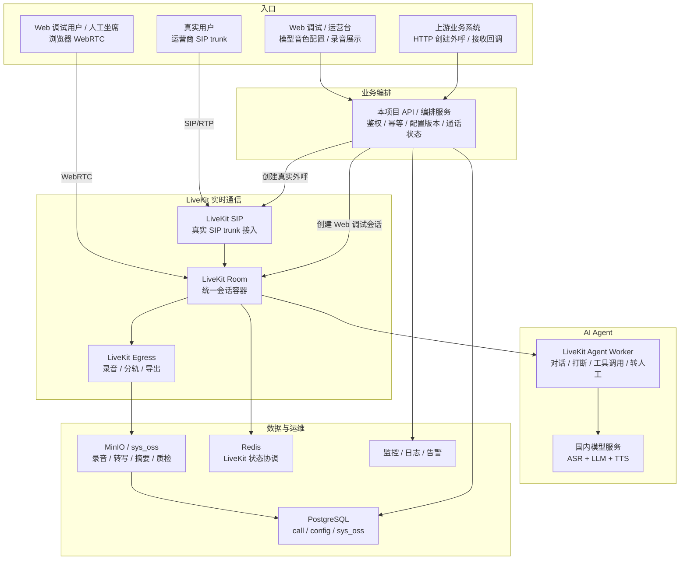
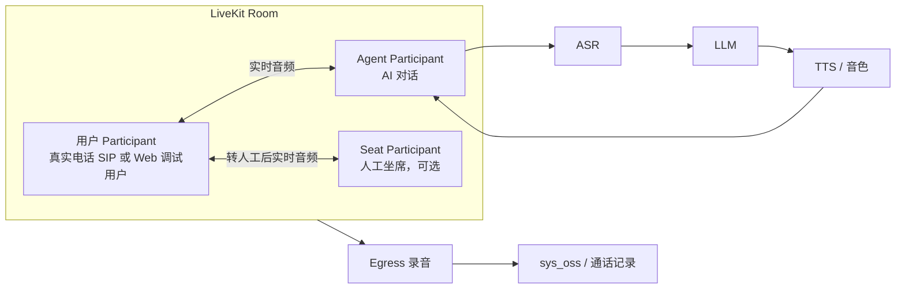

# LiveKit SIP + AI Agent 生产级方案

日期：2026-06-05

## 1. 方案定位

本文档描述的是面向生产环境的 AI 外呼平台方案，不是阶段 1 最小验证方案。

目标是从 0 到 1 建设一套可长期演进的 AI 智能外呼系统，降低端到端语音大模型直连成本，避免自研 SIP/RTP 桥接层，同时保留国内运营商 SIP trunk、固定公网 IP 白名单、PCMA、录音、转人工、监控和合规能力。

推荐主方案：

```text
运营商 SIP trunk
  -> 自托管 LiveKit SIP
  -> LiveKit Server / Room
  -> LiveKit Agent Worker
  -> 国内 ASR / LLM / TTS
  -> 录音 / 转人工 / 业务回调 / 质检
```

这里的“自托管 LiveKit SIP”表示我们把 LiveKit SIP 部署在自己的公网服务器上，让运营商把 SIP trunk 白名单指向我们的公网 IP 和端口。它不是自研 SIP/RTP 桥接层。

只采用自托管 LiveKit SIP，也可以是标准的生产商用架构。生产可用性的关键不在于组件数量，而在于线路兼容性、安全边界、容量、录音、监控、回调、转人工和故障恢复是否闭环。

## 2. 当前事实和关键约束

### 2.1 已知线路信息

当前服务商给出的线路信息：

```text
SIP proxy: 47.94.86.132:5089
主叫号码: 037123124845
传输协议: UDP
号码格式: 国内原始手机号，不加 +86 / 86 / 0 / 9
Codec: PCMA/8000
DTMF: telephone-event / RFC2833，payload 101
RTP profile: RTP/AVP
```

历史文档记录为 IP 白名单接入、无 username/password。生产上线前仍必须让服务商明确以下事实：

1. 该线路到底是否为纯 IP + 端口白名单。
2. 白名单绑定的源 IP 和源端口是什么。
3. 如果要求账号鉴权，auth username/password 是什么。
4. 线路服务商要求的 From、Contact、Via、rport 和号码格式。
5. 是否允许同一主叫号并发外呼。
6. CPS、并发、失败码和风控规则。

### 2.2 现有系统可复用内容

当前 Python 网关已有很多值得复用的业务细节：

```text
app/main.py
app/realtime_phone_gateway.py
app/call_control.py
app/freeswitch_event_socket.py
app/freeswitch_media.py
app/doubao_s2s_client.py
app/doubao_s2s_realtime.py
app/playout_engine.py
app/playout_controller.py
app/voice_activity.py
```

可复用的不是 FreeSWITCH 绑定本身，而是：

1. 外呼请求参数格式。
2. 业务回调语义。
3. 开场白、话术和变量填充。
4. 播放状态和打断处理经验。
5. 通话状态机。
6. 失败码映射。
7. 日志字段和排障经验。
8. 租户、批次、任务、号码等业务 ID 贯穿链路。

### 2.3 当前代码真实状态

截至本文档当前版本，仓库运行时仍是 FreeSWITCH + Python 网关 + 豆包 S2S 主线，尚未接入 LiveKit SDK、LiveKit SIP、LiveKit Agent 或 Egress。

当前事实：

1. `pyproject.toml` 只声明了 `asyncpg`、`websockets` 等依赖，没有 LiveKit 相关依赖。
2. `app/main.py` 的运行入口仍在 `echo` 和 `realtime` 两种媒体模式之间切换。
3. `realtime` 模式通过 `FreeSwitchRealtimeGatewayServer` 接收 FreeSWITCH 媒体，并通过 `DoubaoS2SServerVadSession` 连接豆包端到端实时语音。
4. `/calls` 外呼控制仍通过 FreeSWITCH Event Socket 发起 `originate`。
5. 转人工仍通过 FreeSWITCH `originate`、`uuid_audio_stream stop`、`uuid_bridge`、`uuid_record` 完成。
6. 录音上传链路已经具备直连 MinIO、写 `sys_oss`、回填 `call_record.recording_oss_id` 的能力，但录音来源仍是 FreeSWITCH WAV，不是 LiveKit Egress。
7. `/browser-realtime-test` 和 `/webrtc-agent-test` 是现有调试页，不是 LiveKit Room WebRTC Participant 入口。

因此，本文档后续所有 LiveKit SIP、LiveKit Room、LiveKit Agent、Egress、WebRTC Participant 表述，除非明确标注为当前事实，否则均为重构目标态。

### 2.4 FreeSWITCH 到 LiveKit 的迁移边界

重构目标不是整仓推倒重来，而是把电话和媒体执行层替换为 LiveKit，同时保留已沉淀的业务资产。

| 当前能力 / 模块 | 重构处理 | 说明 |
|---|---|---|
| FreeSWITCH SIP trunk 接入 | 替换为 LiveKit SIP | 真实线路仍要验证号码格式、鉴权、PCMA、DTMF、NAT、CPS 和失败码。 |
| FreeSWITCH RTP / `mod_audio_stream` | 替换为 LiveKit Room 音频流 | 不再自研 SIP/RTP 到模型的桥接层。 |
| FreeSWITCH Event Socket `originate` | 替换为 LiveKit SIP outbound participant 创建 | `/calls` API 语义保留，底层执行器替换。 |
| `uuid_audio_stream break` / 播放完成事件 | 迁移为 Agent 层打断、取消和播放状态 | 现有 playout / barge-in 经验保留为状态机设计输入。 |
| `uuid_bridge` 转人工 | 替换为坐席 WebRTC Participant 加入 Room | Handoff 状态和失败回退策略保留，执行器替换。 |
| `uuid_record` / FreeSWITCH WAV | 替换为 LiveKit Egress | OSS / `sys_oss` / `recording_oss_id` 合同保留。 |
| 豆包 S2S 端到端实时语音 | 阶段性替换为 ASR + LLM + TTS | 如果后续 S2S 成本和控制力合适，可作为备选 provider。 |
| `call_record` 状态回填 | 保留并适配 LiveKit 事件 | 状态来源从 FreeSWITCH channel event 转为 LiveKit/SIP/Agent/Egress 事件。 |
| Flow callback / HTTP Webhook | 保留 | 本项目继续通过 HTTP/Webhook 回调上游，RocketMQ 保留在上游侧。 |
| Prompt / opening / 业务 ID 贯穿 | 保留 | 迁移到 LiveKit Agent 会话初始化和上下文注入。 |

第一版重构应优先抽象出执行器边界：

```text
业务 API / call manager
  -> CallExecutor
     -> FreeSwitchExecutor，现有实现
     -> LiveKitExecutor，新实现
```

这样可以让 `/calls`、`call_record`、`sys_oss`、callback、话术和状态机逐步迁移，而不是一次性删除现有可用链路。

## 3. 生产级推荐架构

### 3.1 总体架构



图中只保留主干关系：

1. 真实线路入口：运营商 SIP trunk 进入 LiveKit SIP，再进入 LiveKit Room。
2. Web 调试入口：浏览器直接以 WebRTC Participant 进入 LiveKit Room，不发起真实 SIP 呼叫。
3. 业务系统和 Web 运营台都先进入本项目 API / 编排服务，再由编排服务创建真实外呼或 Web 调试会话。

两条入口进入 Room 后复用同一套 Agent、模型配置、打断逻辑、录音、转写、摘要、质检和坐席接管能力。

### 3.1.1 单通 Room 内关系



### 3.2 组件职责

| 组件 | 生产职责 | 是否必需 |
|---|---|---:|
| LiveKit Server | Room、Participant、媒体路由、WebRTC 核心 | 是 |
| LiveKit SIP | SIP trunk 与 LiveKit Room 的桥接 | 是 |
| LiveKit Agent Worker | AI 对话控制、模型调用、打断、工具调用、转人工触发 | 是 |
| Redis | LiveKit 组件协调和状态依赖 | 是 |
| Egress | 通话录音、混音、音轨导出 | 生产建议必需 |
| 业务库 PostgreSQL | 通话记录、状态机、任务、回调、审计、`sys_oss` 文件记录 | 是 |
| `sys_oss` 文件体系 | 录音、转写文本、摘要、质检结果的文件索引和归档入口 | 是 |
| HTTP API / Webhook | 上游触发外呼、本项目回调上游状态 | 是 |
| RocketMQ | 上游业务系统内部削峰和异步调度，本项目先不直连 | 上游已有，本项目暂非必需 |
| 监控系统 | 指标、日志、链路追踪、告警 | 是 |
| 轻量坐席台 | 转人工接管、简单坐席状态、CRM 弹屏、结果回填 | 视业务必需 |
| Web 调试 / 运营台 | 非真实线路调试、模型/音色配置、坐席接听、录音展示 | 是 |

### 3.3 外部集成边界

当前生产落地优先采用 HTTP 集成，而不是让 Python Agent 直接接入 RocketMQ：

```text
上游业务系统 / RocketMQ 消费侧
  -> HTTP 调用本项目创建外呼
  -> 本项目创建 LiveKit SIP Participant / Agent 会话
  -> 通话状态、录音结果、质检结果通过 HTTP Webhook 回调上游
```

这种边界更清晰：

1. RocketMQ 保持在上游 Java / 业务系统侧，负责批量任务、削峰和重试。
2. 本项目只提供幂等 HTTP 外呼接口和状态查询接口。
3. 回调地址由上游提供，本项目按事件发送 HTTP Webhook。
4. HTTP 请求和回调必须有 `external_call_id`、幂等键、签名、超时、重试和死信记录。
5. 后续如果 Python 侧确实需要消费 RocketMQ，再作为独立阶段评估。

### 3.4 已确认基础环境参数

真实密码不写入仓库文档，只放在服务器 `.env`、密钥管理或运行环境变量中。

Redis：

```text
host: 81.68.166.109
port: 6379
database: 15
password: 通过 REDIS_PASSWORD 配置，不写入仓库文档
```

业务库 PostgreSQL：

```text
host: 118.89.137.44
port: 15432
database: recov_local
schema: public
username: postgres
password: 通过 POSTGRES_PASSWORD 配置，不写入仓库文档
jdbc_url: jdbc:postgresql://118.89.137.44:15432/recov_local?useUnicode=true&characterEncoding=utf8&useSSL=false&currentSchema=public
```

### 3.5 Web 调试和运营入口

目标态除了真实 SIP 线路，还必须支持 Web 非真实线路测试。这个能力不是替代真实线路，而是为高频调试和运营配置服务。

注意：当前仓库已有 `/browser-realtime-test` 和 `/webrtc-agent-test`，但它们仍服务于现有 FreeSWITCH / HTTP 调试链路，不是 LiveKit Room WebRTC Participant 入口。重构时需要新建或改造 Web 调试入口，让浏览器真正加入 LiveKit Room。

```text
浏览器模拟用户
  -> WebRTC 加入 LiveKit Room
  -> LiveKit Agent 使用同一套 ASR / LLM / TTS / 话术配置
  -> 可选启动 Egress 录音
  -> 录音和调试结果进入 sys_oss / 通话记录
```

Web 调试模式和真实外呼模式的区别：

| 项目 | Web 调试模式 | 真实 SIP 外呼模式 |
|---|---|---|
| 用户来源 | 浏览器麦克风 | 运营商 SIP trunk |
| Participant | WebRTC User Participant | SIP Participant |
| 是否消耗真实线路 | 否 | 是 |
| 是否可调模型/音色 | 是 | 是 |
| 是否可坐席接管 | 是 | 是 |
| 是否可录音展示 | 是 | 是 |
| 是否有 SIP Call-ID | 否 | 是 |
| 是否需要服务商白名单 | 否 | 是 |

Web 调试台至少包括：

1. 模拟用户通话：选择话术、模型、音色后，在网页中直接和 Agent 对话。
2. 音色配置：TTS 供应商、voice、语速、音量、情绪或风格参数。
3. 大模型配置：LLM 供应商、模型名、`base_url`、温度、最大 token、超时。
4. ASR 配置：供应商、语言、热词、标点、端点检测参数。
5. 话术配置：system prompt、开场白、变量、业务工具开关。
6. 坐席管理：坐席在线 / 忙碌 / 离线，接收转人工通知。
7. 坐席接听：坐席加入当前调试 Room，接管浏览器模拟用户。
8. 录音展示：展示混音录音、分轨录音、转写、摘要、质检结果。
9. 调试日志：展示 ASR partial/final、LLM 首 token、TTS 首包、打断事件和错误。

Web 调试产生的通话记录应标记为：

```text
channel = web_debug
is_test = true
provider_call_id = null
sip_call_id = null
livekit_room_name = ...
user_participant_kind = web
```

真实 SIP 外呼产生的通话记录应标记为：

```text
channel = sip_outbound
is_test = false
provider_call_id = 服务商返回或 SIP 侧可关联 ID
sip_call_id = SIP 信令中的 Call-ID
livekit_room_name = ...
user_participant_kind = sip
```

## 4. SIP 接入设计

### 4.1 LiveKit SIP 接入模式

生产主链路让运营商直接对接 LiveKit SIP：

```text
运营商 SIP trunk
  -> LiveKit SIP public IP:port
  -> LiveKit Room
```

优点：

1. 组件少。
2. 不自研 RTP 桥。
3. LiveKit 官方负责 SIP Participant 到 Room 的媒体转换。
4. 适合从验证到生产持续演进。

风险：

1. 对供应商 SIP 行为依赖更强。
2. Header 改写、失败码归一、反扫描能力有限。
3. 如果服务商需要特殊鉴权、rport、Contact 行为，需要逐项验证。
4. 多 trunk、多供应商、多区域时，需要在业务调度层做好线路配置、失败回退和限流。

### 4.2 端口和公网地址

生产环境必须固定：

```text
SIP signaling: UDP/TCP 指定端口
SIP RTP: UDP 指定范围
LiveKit API: 仅内网或受信 IP
WebRTC UDP/TCP: 仅按需要开放
Redis: 不暴露公网
```

LiveKit SIP 在云服务器上必须显式处理公网 NAT 地址。配置项名称以实际部署的 LiveKit SIP Server 版本为准，方向是让 SIP SDP 和 RTP 媒体地址对运营商暴露公网 IP，而不是云主机内网 IP：

```text
nat_1_to_1_ip 或等价公网地址配置: 公网 IP
media_nat_1_to_1_ip 或等价媒体公网地址配置: 公网 IP
use_external_ip: 仅在实测可正确发现公网 IP 时使用
```

否则 INVITE / 200 OK SDP 可能出现 `10.x`、`172.16-31.x`、`192.168.x`，真实运营商无法回 RTP。上线前必须用 SIP trace 或抓包确认 SDP 中的 `c=` 媒体地址和 RTP 端口为公网可达地址。

### 4.3 Codec 策略

生产建议优先固定电话侧为：

```text
PCMA/8000
ptime=20
telephone-event/8000
RTP/AVP
SRTP=off
```

LiveKit 可能在 SDP 中同时带 G722、PCMU、PCMA。若供应商严格要求只出现 PCMA，需要在上线前实测 LiveKit SIP 的 SDP 是否被接受，并确认 trunk / worker 层是否能限制 codec。这个问题必须在真实线路联调阶段闭环。

## 5. AI Agent 设计

### 5.1 推荐 Agent 形态

生产建议使用 LiveKit Agent 作为主 Agent 框架：

```text
LiveKit Room audio
  -> Agent Worker
  -> VAD / turn detection
  -> Streaming ASR
  -> LLM / 对话策略
  -> Streaming TTS
  -> LiveKit Room audio
```

本方案不再把 Pipecat 作为同级推荐路线。核心原因是 LiveKit 已经承担 SIP Participant、Room、Agent、Egress、转人工和 WebRTC 坐席协作，继续使用 LiveKit Agent 可以减少运行时和事件模型的分裂。

LiveKit Agent 原生支持 ASR/STT、LLM、TTS 语音流水线。这里的“适配”不是补齐框架能力，而是接入具体模型供应商的 API。

生产落地按以下方式处理：

1. 国内 LLM：优先使用 OpenAI-compatible 接口，通过 LiveKit OpenAI 插件配置 `base_url` 和模型名，例如 Qwen、DeepSeek、豆包文本模型等兼容接口。
2. ASR/STT：LiveKit Agent 支持 STT 插件和自定义 STT。若目标国内厂商没有现成插件，只需要封装该厂商的流式 WebSocket / HTTP 协议，把音频帧送入厂商 ASR，再把 partial/final 文本事件返回给 LiveKit Agent。
3. TTS：LiveKit Agent 支持 TTS 插件和自定义 TTS。若目标国内厂商没有现成插件，只需要封装该厂商的流式合成接口，把文本送入厂商 TTS，再把音频帧返回给 LiveKit Agent 播放。
4. 国内端到端 S2S：只有在成本、延迟和控制力都合适时再评估；当前目标是降低豆包 S2S 成本，因此主方案采用 ASR + LLM + TTS 拆分。

因此，ASR 和 TTS 不是框架不支持，而是具体国内厂商可能没有官方现成插件。需要开发的是 provider adapter，不是电话音频桥、播放控制、打断控制或 Room 媒体层。

Pipecat 仅作为技术备选：当某个国内供应商已经有成熟 Pipecat 适配，而 LiveKit 适配成本明显更高时，可以单独验证。但默认不引入 Pipecat，避免同时维护两套 Agent 生命周期、事件、指标和打断语义。

### 5.1.1 阿里系 ASR / TTS 支持结论

结论：阿里系可以支持，但当前按自定义 provider adapter 接入，不按 LiveKit 官方现成插件接入。

已确认事实：

1. LiveKit Agent 支持 STT、LLM、TTS 模型流水线，并支持插件和自定义模型接入。
2. LiveKit 官方 STT / TTS 插件列表当前未看到 Alibaba Cloud、DashScope、CosyVoice 的现成插件。
3. 阿里云智能语音交互 Real-time Speech Recognition 支持 WebSocket 实时语音转文字，客户端上传音频流，服务端返回识别事件。
4. 阿里云 Model Studio Real-time speech synthesis 支持 Qwen-TTS、CosyVoice 等模型，支持 WebSocket 流式输入和流式输出。
5. CosyVoice / Qwen-TTS 的鉴权需要在 WebSocket 握手请求头中设置，浏览器原生 WebSocket 不能直接设置该请求头，因此必须由后端 Agent Worker 或后端代理访问，不能把 API key 放前端。

推荐接入方式：

```text
LiveKit 音频帧
  -> Aliyun ASR Adapter
  -> 阿里云实时 ASR WebSocket
  -> partial / final 文本
  -> LiveKit Agent

LLM token / sentence chunk
  -> Aliyun TTS Adapter
  -> 阿里云 Qwen-TTS / CosyVoice WebSocket
  -> PCM / MP3 / Opus 音频帧
  -> LiveKit Agent 播放
```

电话场景优先建议：

1. ASR 输入优先支持 8k 电话音频；如果模型要求 16k，在 adapter 内做一次上采样。
2. TTS 输出优先选择 PCM，减少 MP3 解码和额外缓冲；如果使用 MP3/Opus，要确认首包延迟和解码成本。
3. Adapter 必须流式发送和流式接收，禁止等整句 ASR、整段 LLM 或整段 TTS 完成后再处理。
4. Web 调试台必须展示 ASR 首包、LLM 首 token、TTS 首包和端到端响应时间，用于验证阿里系实际延迟。

### 5.1.2 公有云在线方案 / 本地私有化方案选型

第一阶段先按公有云在线方案落地：云端 ASR、云端 TTS、云端 LLM，不上本地模型，不引入 GPU 推理服务。原因是上线更快、运维更轻、能先验证 LiveKit SIP / Room / Agent / callback / recording 这条主链路。

本地私有化方案先作为后续扩展目标，不进入第一版实现范围。下表中的延迟和容量为方案目标或经验估算，必须在真实线路、真实模型供应商和真实并发下重新压测确认，不能直接写成生产 SLA。

| 项目 | 公有云在线方案，第一阶段采用 | 本地私有化方案，后续备选 |
|---|---|---|
| ASR | 阿里云实时 NLS，优先验证 8k 电话音频效果 | FunASR / Paraformer 类本地流式 ASR，需验证 8k 电话音频和热词 |
| TTS | 阿里云 CosyVoice / Qwen-TTS 云端 API | CosyVoice3 或等价本地 TTS，需自建推理和音色管理 |
| LLM | 通义 Flash / 豆包 Flash / Qwen / DeepSeek 等 OpenAI-compatible 接口 | Qwen3-7B-Instruct 4bit 或等价本地模型，通过 OpenAI-compatible 服务暴露 |
| 自定义音色 | 用户上传样本后提交云端克隆，云端生成 `voiceId` | 用户样本进入自有 MinIO / `sys_oss`，本地提取声纹或音色特征，自建 `voiceId` |
| 数据边界 | 音色样本、ASR/TTS 音频会进入第三方云服务 | 音色、录音、特征和推理全部留在自有网络 |
| 延迟目标 | 全链路 p95 先按 1200-1800 ms 预算，公网波动需实测 | 全链路 p95 可按 720-980 ms 目标评估，但强依赖 GPU、模型和并发 |
| 适用阶段 | 快速上线、小规模验证、中小客户起步 | 隐私合规、大批量外呼、大量自定义音色、长期成本优化 |
| 主要优点 | 零硬件投入、免模型运维、扩容简单 | 音色数量更自由、无单次调用费、数据安全边界更强、延迟抖动更小 |
| 主要风险 | 音色样本上第三方云、按量计费、配额和供应商策略限制 | 前期硬件投入、推理服务维护、模型升级和容量规划复杂 |

公有云在线方案的第一版组件：

```text
LiveKit Room audio
  -> LiveKit Agent Worker
  -> Aliyun NLS ASR Adapter
  -> OpenAI-compatible LLM Adapter
  -> Aliyun CosyVoice / Qwen-TTS Adapter
  -> LiveKit Room audio
```

公有云自定义音色逻辑：

```text
用户上传音频样本
  -> 本项目保存上传记录和审核状态
  -> 提交阿里云端音色克隆
  -> 阿里云生成 voiceId
  -> 本项目保存 voiceId、租户、业务配置和供应商元数据
  -> 通话时按 voiceId 调用云端 TTS
```

这里必须明确：公有云在线方案无法做到音色样本和声纹数据完全自留。若客户有语音样本不出网、声纹不出机房、金融催收强合规等要求，应切到后续本地私有化方案，而不是在公有云方案里做伪合规承诺。

本地私有化方案的目标逻辑：

```text
用户上传音频样本
  -> 自有 MinIO / sys_oss
  -> 本地 GPU 提取声纹或音色特征
  -> 自建 voiceId 和音色特征库
  -> 本地 TTS 推理服务
  -> 通话时按本地 voiceId 合成
```

混合方案只作为第二阶段以后再做：

1. Web 调试台可以优先试验本地模型，降低反复克隆和调试成本。
2. 生产正式外呼先走公有云在线方案。
3. 对合规要求高、大批量或大量定制音色的租户，再按租户切到本地私有化 provider。
4. 代码层通过 provider profile 切换 ASR / LLM / TTS 地址和鉴权，不建议第一版只靠一个裸 `is_local` 参数承载所有差异。

一句话选型：

1. 只求快速上线、少量定制音色、无数据不出网要求：先用公有云在线方案。
2. 要自建用户音色、隐私合规、大批量长期外呼：再规划全本地私有化方案。

### 5.2 模型拆分

为了降低豆包端到端 S2S 成本，生产建议拆成：

| 环节 | 推荐能力 |
|---|---|
| VAD | 本地 VAD 或模型侧 VAD |
| ASR | 国内流式 ASR，支持 8k 电话音频或 16k 上采样 |
| LLM | Qwen / DeepSeek / 豆包文本模型等流式输出 |
| TTS | 国内低延迟流式 TTS |
| 质检 | 通话后异步模型，不进实时链路 |

实时链路中不要做重型后处理。质检、摘要、标签、承诺还款识别可以在通话结束后异步完成。

### 5.3 打断和播放控制

LiveKit Agent 可以处理 AI 语音播放、用户说话打断、语音流中断等逻辑，但生产环境仍需设计业务状态：

1. AI 正在说话。
2. 用户开始说话。
3. TTS 是否可取消。
4. LLM 是否可取消。
5. 当前话术是否允许被打断。
6. 打断后是否保留上下文。
7. 尾音 drain 和音频清理。
8. 转人工、挂机、按键等高优先级事件是否能立即抢占。

旧系统里的 `playout_engine`、`playout_controller`、`voice_activity` 经验应迁移为 Agent 层状态机，而不是在 SIP/RTP 桥接层重写。

### 5.4 延迟目标

生产目标建议：

| 指标 | 目标 |
|---|---:|
| 用户说完到 ASR partial | 100-300 ms |
| 用户说完到 LLM 首 token | 300-800 ms |
| 用户说完到 TTS 首包 | 700-1500 ms |
| 打断停止播放 | 100-300 ms |
| 端到端主观响应 | 1.0-2.0 秒 |

800 ms 以内可以作为理想目标，但在电话线、ASR、LLM、TTS 都走公网国内供应商时，生产 SLA 不应承诺过窄。更合理的是把 p95、p99 分开监控。

## 6. 转人工设计

### 6.0 当前转人工实现和迁移边界

当前仓库的转人工实现仍基于 FreeSWITCH：

```text
AI 识别转人工
  -> 等待坐席 claim
  -> FreeSWITCH originate 坐席分机
  -> uuid_audio_stream stop 停止 AI 媒体流
  -> uuid_bridge 客户通道和坐席通道
  -> uuid_record 分别录 customer.wav / agent.wav
```

LiveKit 重构后应保留的是转人工状态机、等待超时、失败提示、人工阶段 transcript 合并、业务回调语义；替换的是 FreeSWITCH 执行器。

### 6.1 推荐方式：WebRTC 坐席接管

本方案优先采用轻量 WebRTC 坐席方式，不做完整呼叫中心，不做排队、技能组、多坐席抢接和复杂 ACD。

核心流程：

```text
用户电话作为 SIP Participant
AI Agent 作为 Agent Participant
人工坐席作为 WebRTC Participant

AI 识别转人工
  -> 通知指定坐席或当前在线坐席
  -> 坐席打开坐席台并加入同一个 LiveKit Room
  -> AI 静音或退出
  -> 坐席与用户通话
  -> 通话结束后坐席填写结果
```

这个方式的好处：

1. 不依赖运营商 REFER。
2. 不需要再次拨打人工手机号。
3. 用户、AI、人工都在同一个 Room 内，录音和事件连续。
4. 坐席前端可以直接展示客户信息、AI 摘要和通话状态。
5. 实现复杂度明显低于完整 PBX / ACD。

### 6.2 坐席能力范围

当前阶段只实现必要能力：

1. 坐席登录。
2. 坐席在线 / 忙碌 / 离线。
3. 坐席收到转人工通知。
4. 坐席加入指定 LiveKit Room。
5. 坐席接管后 AI 静音或退出。
6. 坐席查看 AI 摘要和客户基础信息。
7. 坐席填写处理结果。
8. 转人工后录音继续。

当前阶段明确不做：

1. 排队。
2. 技能组。
3. 多坐席抢接。
4. 复杂坐席分配策略。
5. 传统 SIP 分机注册。
6. 咨询、保持、三方、监听、强插。
7. 完整呼叫中心报表。

### 6.3 转人工失败处理

简单处理即可：

1. 没有在线坐席：AI 告知稍后回拨或记录人工跟进。
2. 坐席超时未接：AI 恢复对话或结束通话并回调上游。
3. 坐席加入失败：记录失败原因，回调上游。
4. 用户等待期间：播放简短等待提示，不做复杂排队音乐。

### 6.4 真实电话人工兜底

如果后续业务要求人工必须接真实电话，再单独评估 LiveKit SIP 转接或二次呼叫。当前生产方案不把真实电话人工转接作为主路径。

## 7. 录音和质检

### 7.1 录音方式

生产建议使用 LiveKit Egress：

```text
LiveKit Room
  -> Egress Worker
  -> WAV/MP3
  -> 复用现有文件归档能力
  -> 业务库 PostgreSQL 的 sys_oss 记录文件索引
```

录音策略：

1. 默认双向混音录音。
2. 必要时保留分轨录音，区分用户、AI、人工。
3. 录音开始/停止事件进入业务审计。
4. 转人工后继续录音。
5. 录音失败不应中断通话，但必须告警。

当前仓库已有的录音上传链路仍然有迁移价值：

```text
FreeSWITCH WAV
  -> 读取宿主机录音文件
  -> 直连 MinIO 上传
  -> 写 public.sys_oss
  -> 回填 public.call_record.recording_oss_id
```

LiveKit 重构后，录音来源从 FreeSWITCH WAV 改成 Egress 输出，但 MinIO / `sys_oss` / `recording_oss_id` 合同应继续复用。第一版不应同时重做一套文件索引系统。

### 7.2 存储和 sys_oss

已实测当前业务库 `public.sys_oss` 存在，主键为 `oss_id`，当前约 1193 条记录，`service` 均为 `minio`。已有文件后缀主要是 `.pdf`、`.zip`、`.png`、`.xlsx`、`.docx`，暂未观察到 `.wav` 或 `.mp3`，因此上线前必须验证现有文件归档链路是否允许音频后缀、音频 MIME 和较大录音文件。表结构如下：

| 字段 | 类型 | 说明 |
|---|---|---|
| `oss_id` | `bigint` | 主键，当前无数据库默认值，通常由业务侧生成 |
| `tenant_id` | `varchar(20)` | 租户 ID，默认 `000000` |
| `file_name` | `varchar(255)` | 存储文件名 |
| `original_name` | `varchar(255)` | 原始文件名 |
| `file_suffix` | `varchar(10)` | 文件后缀 |
| `url` | `varchar(500)` | 文件访问地址或对象路径 |
| `ext1` | `varchar(500)` | 扩展字段 |
| `create_dept` | `bigint` | 创建部门 |
| `create_by` | `bigint` | 创建人 |
| `create_time` | `timestamp` | 创建时间 |
| `update_by` | `bigint` | 更新人 |
| `update_time` | `timestamp` | 更新时间 |
| `service` | `varchar(20)` | 存储服务，默认 `minio` |

建议：

```text
sys_oss: 原始录音、转写文本、摘要、质检结果的文件记录
业务表: call_id、tenant_id、task_id、record_id、sys_oss_id、hash、时长、状态
```

本项目不再单独设计一套录音文件索引。录音、转写和质检产物统一进入现有业务库 PostgreSQL 的 `sys_oss` 文件体系，再由通话记录表保存 `sys_oss_id` 或等价外键。

`sys_oss` 本身只有文件索引字段，不包含通话时长、声道、音频 hash、录音开始/结束时间、质检状态等审计字段。因此生产中仍需要在通话记录或录音记录表中保存：

1. `call_id`、`tenant_id`、`task_id`、`record_id`。
2. 混音录音 `mixed_oss_id`。
3. 用户分轨 `user_track_oss_id`。
4. AI 分轨 `agent_track_oss_id`。
5. 人工分轨 `human_track_oss_id`。
6. 录音时长、采样率、声道、文件大小、hash。
7. 转写、摘要、质检状态和失败原因。

如果 `sys_oss` 存的是对象存储索引，文件本体继续走现有 OSS 后端；如果当前实现是把文件本体放进 PostgreSQL，需要额外设置录音大小、保留周期和归档策略，避免大文件长期压垮业务库。

录音文件命名建议：

```text
tenant/{tenant_id}/date/{yyyy-mm-dd}/call/{call_id}/mixed.wav
tenant/{tenant_id}/date/{yyyy-mm-dd}/call/{call_id}/transcript.json
```

### 7.3 质检

质检不要进入实时链路。通话结束后异步执行：

1. ASR 全量转写。
2. 对话摘要。
3. 用户意向识别。
4. 投诉/敏感词检测。
5. 承诺还款、转人工、拒绝沟通等标签。
6. 坐席服务质量评分。

## 8. 状态机和数据模型

### 8.1 通话状态

建议统一状态：

```text
CREATED
QUEUED
DIALING
RINGING
ANSWERED
AI_TALKING
USER_TALKING
HUMAN_TRANSFER_REQUESTED
HUMAN_TRANSFER_RINGING
HUMAN_TRANSFER_CONNECTED
COMPLETED
FAILED
CANCELED
TIMEOUT
```

### 8.2 核心 ID

每通电话必须贯穿：

```text
tenant_id
batch_id
task_id
record_id
customer_id
call_id
channel
is_test
livekit_room_name
livekit_participant_id
sip_call_id，可空，Web 调试模式为空
provider_call_id，可空，Web 调试模式为空
user_participant_kind: sip / web
external_call_id
```

### 8.3 事件表

建议保存事件流：

```text
call_created
web_debug_started
web_user_joined
sip_invite_sent
sip_trying
sip_ringing
sip_answered
agent_joined
config_selected
asr_partial
asr_final
llm_response_started
tts_started
barge_in
transfer_requested
transfer_started
transfer_connected
seat_notified
seat_joined
seat_left
recording_started
recording_finished
call_ended
callback_sent
callback_failed
```

事件比单一状态更利于排障和审计。

## 9. 高可用和容量设计

### 9.1 单机生产起步

100 并发以内可以先单机或双机：

```text
1 台 SIP/LiveKit 主机
1 台 Agent 主机
1 套 Redis HA 或云 Redis
1 套业务库 PostgreSQL
1 套 sys_oss 文件归档能力
```

但即使单机起步，也必须具备：

1. 快速回滚。
2. 备份配置。
3. 健康检查。
4. 日志和抓包能力。
5. 资源水位告警。

### 9.2 推荐生产拓扑

```text
LiveKit SIP: 2 台，主备或按线路分流
LiveKit Server: 2-3 台
Redis: Sentinel / Cluster / 云 Redis
Agent Worker: N 台，按并发水平扩容
Egress Worker: 独立节点
业务 API: 2 台以上
业务库 PostgreSQL: 主从或云数据库，包含 sys_oss
文件归档: 复用现有 sys_oss 对应的存储后端
```

### 9.3 容量估算

100 路并发电话的主要压力不在 LiveKit Server，而在：

1. ASR 并发。
2. TTS 并发。
3. LLM token 生成速度。
4. Agent Worker 内存和网络。
5. 录音 Egress。
6. 运营商 CPS 和并发限制。

粗略估算：

| 项目 | 100 并发建议 |
|---|---|
| LiveKit Server | 4-8 vCPU，8-16 GB |
| LiveKit SIP | 2-4 vCPU，4-8 GB |
| Agent Worker | 视模型 SDK 而定，建议 2-4 台起 |
| Egress | 独立 4-8 vCPU |
| Redis | 生产 HA，低延迟 |
| 带宽 | 100 路 8k 电话音频本身不大，但模型和录音上传要留余量 |

## 10. 安全和合规

### 10.1 网络安全

必须执行：

1. SIP 端口只允许服务商 SBC IP 访问。
2. RTP 端口只允许服务商 SBC IP 访问。
3. LiveKit API 不开放公网，或仅允许受信 IP。
4. Redis 不开放公网。
5. Agent 管理 API 需要鉴权。
6. TURN/TLS/WSS 使用正式证书。
7. 禁止把 `.env`、录音、日志密钥提交仓库。

### 10.2 SIP 防扫描

公网 SIP 会被持续扫描。生产必须：

1. 安全组限制来源。
2. 云防火墙或主机防火墙限频。
3. 拒绝非服务商 IP。
4. 记录异常 REGISTER / INVITE / OPTIONS。
5. 告警扫描峰值。

### 10.3 合规

至少考虑：

1. 外呼时间窗口。
2. 黑名单和退订。
3. 录音告知。
4. 敏感信息脱敏。
5. 号码加密存储。
6. 通话日志权限控制。
7. 坐席访问审计。
8. 模型供应商数据合规。

## 11. 监控和告警

### 11.1 指标

必须监控：

```text
呼叫创建数
INVITE 发出数
100 / 180 / 183 / 200 / 4xx / 5xx 数量
ASR 首包延迟
LLM 首 token 延迟
TTS 首包延迟
打断延迟
平均通话时长
接通率
转人工率
录音成功率
回调成功率
Agent Worker CPU / 内存
LiveKit Room 数
SIP Participant 数
Egress 任务数
```

### 11.2 日志

日志必须包含：

```text
tenant_id
task_id
record_id
call_id
sip_call_id
room_name
participant_identity
provider_ip
provider_response_code
model_request_id
callback_request_id
```

不要在普通日志打印：

1. 完整手机号。
2. 身份证。
3. 完整住址。
4. 录音原文中的敏感信息。
5. API key / token / password。

### 11.3 排障工具

生产节点应保留：

```text
tcpdump
sngrep
tshark
jq
curl
docker compose
```

每次真实线路问题至少保存：

1. SIP trace。
2. LiveKit SIP 日志。
3. Agent 日志。
4. 业务 call_id。
5. 服务商返回码。
6. 号码脱敏后的测试对象。

## 12. 部署策略

### 12.1 环境划分

```text
dev: Web 调试 / 本地软电话 / mock SIP provider
test: Web 调试 + 云上测试 SIP trunk，小流量
staging: 生产同款线路，限制号码
prod: 正式生产
```

### 12.2 配置管理

配置分层：

```text
基础配置: Git
密钥配置: Secret Manager / 环境变量
线路配置: 数据库 + 审计
模型配置: 数据库 + 灰度版本
话术配置: 数据库 + 发布审批
```

### 12.3 灰度

上线顺序：

1. Web 调试链路通过。
2. Web 调试下完成音色、模型、话术、录音、坐席接管验收。
3. 单通真实拨测。
4. 10 通人工观察。
5. 1 个租户小批量。
6. 限 CPS。
7. 限并发。
8. 逐步替换原 FreeSWITCH + 豆包 S2S 链路。

## 13. 测试验收

### 13.1 Web 调试台验收

必须通过：

1. 浏览器模拟用户能创建调试 Room。
2. 浏览器麦克风音频能进入 Agent。
3. Agent 回复能在网页中播放。
4. 可选择不同音色并实时验证。
5. 可选择不同 LLM / ASR / TTS 配置并实时验证。
6. 可查看 ASR partial/final、LLM 首 token、TTS 首包和打断事件。
7. 可触发转人工，坐席能加入同一个 Room。
8. 坐席能接管浏览器模拟用户通话。
9. 调试通话可录音。
10. 录音文件、转写、摘要、质检结果能在网页中展示。
11. 调试通话记录标记为 `channel=web_debug`、`is_test=true`。
12. Web 调试不会发起真实 SIP 呼叫。

### 13.2 SIP 主链路验收

必须通过：

1. 正常接通。
2. 被叫未接。
3. 被叫拒接。
4. 忙线。
5. 空号或异常号。
6. 运营商 4xx / 5xx。
7. 用户主动挂机。
8. AI 主动挂机。
9. RTP 双向语音。
10. PCMA 协商。

### 13.3 AI 体验验收

必须通过：

1. 开场白正确。
2. 用户打断 AI。
3. AI 不抢话。
4. 静音超时。
5. 噪声环境。
6. 短句、长句、重复。
7. 业务变量正确。
8. 模型失败兜底。
9. TTS 失败兜底。
10. ASR 失败兜底。

### 13.4 转人工验收

必须通过：

1. AI 识别转人工意图。
2. 指定坐席收到转人工通知。
3. 坐席加入 LiveKit Room。
4. AI 静音或退出。
5. 坐席与用户双向通话正常。
6. 坐席超时有回退。
7. AI 摘要展示准确。
8. 坐席结果可回填。
9. 转人工后录音连续。

### 13.5 录音验收

必须通过：

1. 正常通话录音成功。
2. 用户挂机录音落盘。
3. 转人工录音连续。
4. 录音文件可下载。
5. 录音 metadata 正确。
6. Egress 失败有告警。

## 14. 风险清单

| 风险 | 影响 | 应对 |
|---|---|---|
| 服务商鉴权方式不清 | 无法外呼 | 要求服务商确认 IP 白名单或账号鉴权参数 |
| 坐席加入 Room 失败 | 无法人工接管 | AI 回退、记录失败原因并回调上游 |
| LiveKit SDP codec 不可控 | 供应商拒绝 | 上线前实测并固定 trunk codec 配置 |
| API/SIP 端口公网暴露 | 被扫描攻击 | 安全组限制服务商 IP |
| 模型延迟波动 | 用户体验差 | 多模型供应商、超时兜底 |
| TTS 首包慢 | AI 反应慢 | 流式 TTS、短句生成 |
| 公有云音色样本上云 | 不满足强合规客户要求 | 第一阶段只用于无数据不出网要求的租户，强合规租户切本地私有化方案 |
| 云端 voiceId 配额或策略变化 | 自定义音色不可用或成本上升 | 保存供应商元数据、配额水位和失败状态，后续准备本地私有化迁移路径 |
| Egress 失败 | 缺录音 | 双重录音或失败告警 |
| 坐席台能力不足 | 转人工不可运营 | 先实现在线状态、通知、入会、弹屏和结果回填 |
| Web 调试配置误用于生产 | 真实外呼效果异常 | 配置版本区分 test/prod，发布需审批 |
| 浏览器 WebRTC 接入失败 | 无法网页调试或坐席接管 | 正式域名、TLS、TURN 和浏览器权限预检 |
| Redis 单点 | LiveKit 状态异常 | Redis HA |
| Agent 单点 | 通话失败 | Worker 池和自动重启 |

## 15. 分阶段实施建议

重构不能从“完整生产架构”一口吃下去，应先做两个相互独立的最小闭环：一个验证 LiveKit Agent 和 WebRTC Room，另一个验证 LiveKit SIP 与真实运营商线路。两条 PoC 都通过后，再迁移业务闭环。

### 阶段 A：LiveKit Web Room + Agent 最小闭环

目标：不拨真实电话，先验证 LiveKit Room、浏览器 WebRTC 和 Agent Worker 的实时语音闭环。

事项：

1. 新增最小 LiveKit 配置和本地 / 测试环境启动方式。
2. API 创建 `web_debug` Room 并签发浏览器 token。
3. 浏览器模拟用户加入 Room。
4. Agent Worker 加入同一个 Room。
5. Agent 使用公有云在线 provider adapter：阿里云 NLS ASR、OpenAI-compatible LLM、阿里云 CosyVoice / Qwen-TTS。
6. Agent 能订阅浏览器音频并播放回复音频。
7. 页面显示 Room、participant、Agent 状态和基础错误。

通过标准：

```text
不拨真实电话
浏览器麦克风音频进入 LiveKit Room
Agent 能听见并回复
浏览器能听到 Agent
断开和重连有可见状态
```

这一阶段先不要接 `call_record`、`sys_oss`、Egress、转人工和上游 callback，避免把通信 PoC 和业务闭环混在一起。

### 阶段 B：LiveKit SIP outbound 单通真实线路 PoC

目标：用最小 Agent 或 echo Agent 验证真实 SIP trunk 能否通过 LiveKit SIP 接入 Room。

事项：

1. 服务商确认 IP/端口白名单、是否账号鉴权、From / Contact / Via / rport / 号码格式。
2. 部署 LiveKit SIP Server，固定 SIP signaling 端口和 RTP 端口范围。
3. 显式处理公网 NAT 地址，并用 SIP trace 证明 SDP 不暴露内网 IP。
4. 创建 outbound trunk 和 dispatch / room 规则。
5. API 或脚本创建 SIP participant，拨打一个受控测试手机号。
6. 电话用户进入 LiveKit Room。
7. 最小 Agent 能与电话用户双向语音。

通过标准：

```text
手机震铃
接听成功
SIP 200 OK
SDP 媒体地址为公网 IP
PCMA/8000 双向 RTP
LiveKit Room 有 SIP Participant
Agent 能听能说
用户挂机后状态正确结束
```

这一阶段只证明线路和媒体，不承诺业务回调、录音归档和批量外呼。

### 阶段 C：业务 API 和状态机迁移

目标：把现有 `/calls`、业务 ID、状态机、prompt/opening、`call_record` 和 callback 接到 LiveKit 执行器。

事项：

1. 抽出 `CallExecutor` 或等价执行器边界。
2. 保留现有 HTTP `/calls` 请求语义和幂等语义。
3. 新增 `LiveKitExecutor` 创建 Room、SIP participant、Agent 会话。
4. 将 LiveKit / SIP / Agent 事件映射为现有通话状态。
5. 保留 `tenantId`、`taskId`、`callId`、`debtId`、`external_call_id` 等业务 ID 贯穿。
6. 保留上游 HTTP callback 和 HMAC 签名。
7. 保留现有 prompt / opening 准备逻辑，并迁移到 Agent 会话初始化。
8. 第一版 provider profile 固定为公有云在线方案；本地私有化 provider 只保留接口扩展点，不做实际接入。

通过标准：

```text
/calls 返回 202 Accepted
GET /calls/{call_id} 能看到 LiveKit 侧状态
真实 call_record 能更新 started / failed / completed
callback 能按 ACCEPTED / SUCCESS / FAILED 发出
本地 synthetic 样本不会冒充真实 call_record 回填
```

### 阶段 D：录音、转写、sys_oss 和质检迁移

目标：把 LiveKit Egress 输出接入现有文件归档和业务记录合同。

事项：

1. 创建 Egress 录音任务。
2. 明确混音录音和分轨录音的第一版取舍。
3. Egress 输出进入现有 MinIO / `sys_oss` 链路。
4. `call_record.recording_oss_id` 或新录音 metadata 字段回填。
5. 通话后异步转写、摘要、标签和质检。
6. Web 调试通话和真实 SIP 通话都能展示录音与 transcript。

通过标准：

```text
Egress 文件可访问
sys_oss 有录音文件记录
call_record 能关联录音 oss id
上传失败不回滚通话结果
质检和摘要异步执行，不进入实时链路
```

### 阶段 E：轻量 WebRTC 坐席接管

目标：用 LiveKit Room participant 模型替换 FreeSWITCH `uuid_bridge` 转人工。

事项：

1. 坐席登录和在线 / 忙碌 / 离线状态。
2. AI 识别转人工后通知坐席。
3. 坐席通过浏览器 token 加入指定 Room。
4. 坐席加入后 AI 静音、暂停或退出。
5. 用户与坐席双向通话。
6. 坐席超时或加入失败时回退。
7. 坐席结果回填并触发业务 callback。
8. 转人工阶段录音连续。

通过标准：

```text
坐席能加入同一 LiveKit Room
AI 不再和坐席抢话
客户和坐席双向音频正常
超时有失败提示和状态回调
录音和 transcript 能覆盖人工阶段
```

### 阶段 F：生产扩容和替换 FreeSWITCH 主线

目标：稳定承载批量外呼，并逐步替换原 FreeSWITCH + 豆包 S2S 链路。

事项：

1. Agent Worker 池。
2. Redis HA。
3. Egress Worker 独立部署。
4. LiveKit SIP 多实例或按线路分流。
5. 限 CPS、限并发、黑名单和外呼时间窗。
6. p95 / p99 指标、日志、链路追踪和告警。
7. 失败码归一和运营商 CDR 对账。
8. 灰度租户、小批量、回滚预案。

通过标准：

```text
小批量真实外呼稳定
核心指标按 p95 / p99 可观测
失败可定位到 SIP / Room / Agent / 模型 / Egress / callback 层
FreeSWITCH 主线可按租户或流量灰度下线
```

## 16. 推荐结论

如果从 0 到 1 做新项目，生产级推荐仍然是：

```text
自托管 LiveKit SIP + LiveKit Server + LiveKit Agent
```

但必须补齐生产能力：

1. 服务商线路参数确认。
2. SIP 端口和鉴权方式确认。
3. Web 调试 / 运营台。
4. Egress 录音和 Web 展示。
5. 轻量 WebRTC 人工坐席路径。
6. 监控、告警、日志、抓包。
7. Redis / Agent / Egress 高可用。
8. 业务状态机和合规审计。

当前不建议回到 Drachtio + RTPengine + 自研桥接作为主方案，原因是桥接层复杂度会回到自己身上。LiveKit 的优势是把 SIP Participant 到 Room、音频流、Agent 协作、录音和转人工能力放在同一套生态里。

但也不能把 LiveKit 理解为完整呼叫中心。它解决实时媒体和 Agent；当前阶段只需要轻量坐席接管能力，不做排队、技能组和复杂 ACD。

## 17. 参考资料

1. LiveKit SIP self-hosting: https://docs.livekit.io/transport/self-hosting/sip-server/
2. LiveKit ports and firewall: https://docs.livekit.io/home/self-hosting/ports-firewall/
3. LiveKit SIP outbound calls: https://docs.livekit.io/sip/outbound-calls
4. LiveKit SIP GitHub: https://github.com/livekit/sip
5. LiveKit Agents models and plugins: https://docs.livekit.io/agents/models/
