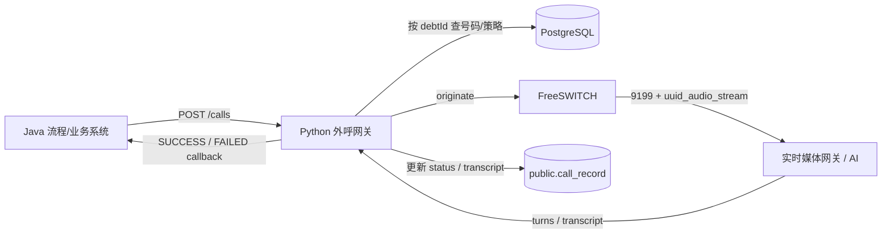
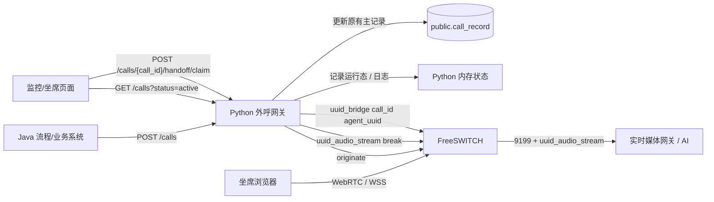
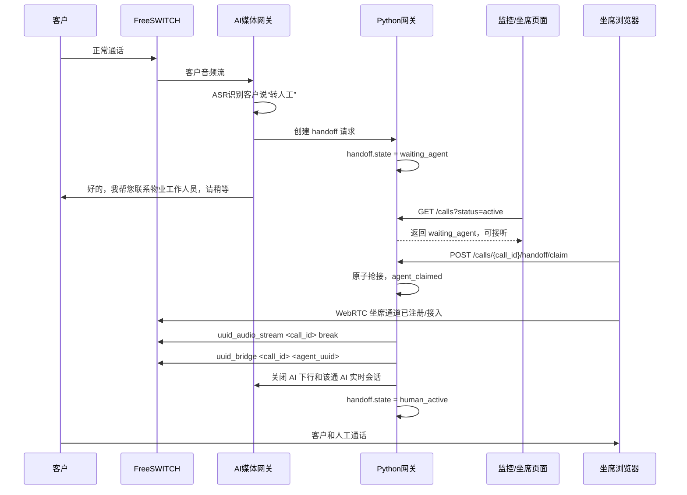
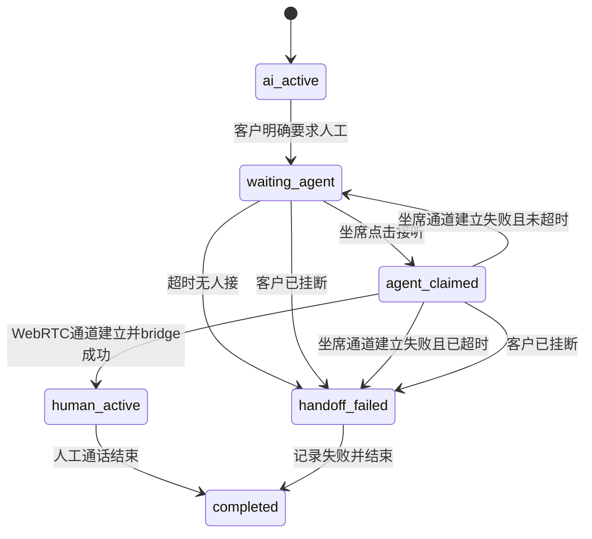
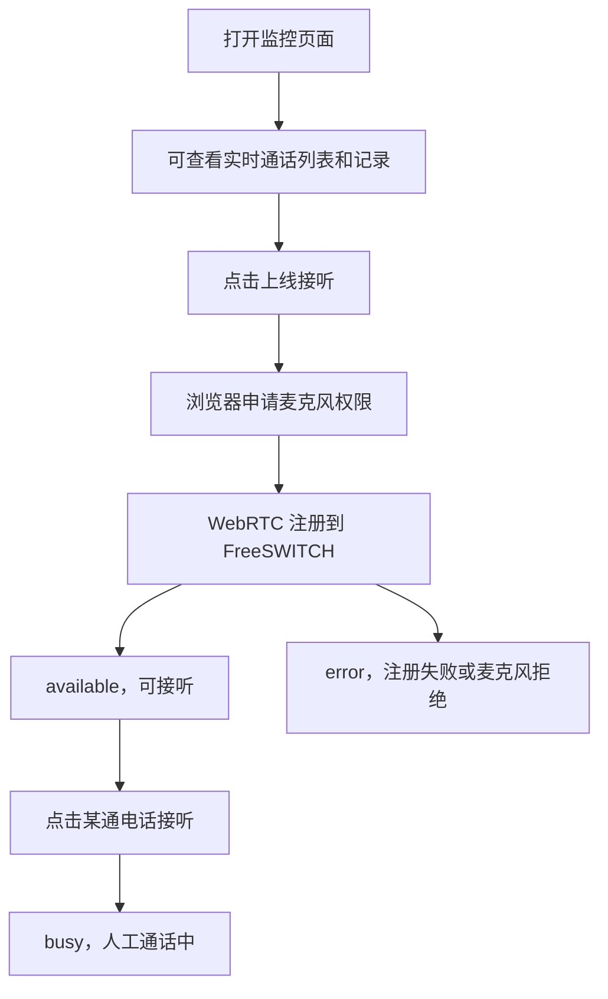
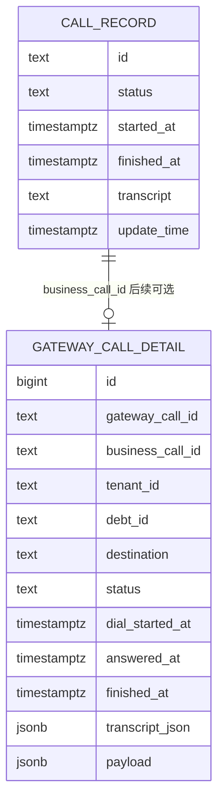

# 物业费催收转人工技术方案

## 1. 结论先行

第一版只做“客户主动要求转人工”：

```text
客户在 AI 通话中明确说转人工
-> AI 说一句等待话术
-> 通话进入 waiting_agent
-> 坐席在同一个监控页面点击接听
-> 浏览器 WebRTC 坐席通道接入 FreeSWITCH
-> FreeSWITCH bridge 客户通道和坐席通道
-> AI 停止下行并关闭该通 AI 实时会话
```

第一版不包含：

```text
人工主动接管
监听质检
情绪触发接管
人工阶段实时转写
独立坐席工作台
小区路由
```

已确认 `analysis_result` 需要分析整通电话，因此第一版包含：

```text
人工阶段音频采集
挂断后异步 ASR
AI turns + 人工 turns 合并写入 call_record.transcript
整通电话完整 transcript 写入后再 callback Java
```

核心设计原则：

```text
不破坏现有 /calls、call_record、Java callback、FreeSWITCH 9199 媒体链路。
转人工作为增量能力新增接口、状态和必要过程记录。
第一版不新增 gateway_call_detail，过程状态先放 Python 内存、日志和最终 call_record.transcript。
```

## 2. 现有外部契约

当前系统已经和 Java、PostgreSQL、FreeSWITCH 有固定约定。转人工改造必须先保护这些约定。

| 外部对象 | 当前约定 | 转人工改造原则 |
|---|---|---|
| Java 调 Python | Java 调 `POST /calls` 创建 AI 外呼 | 不改原入参和响应语义 |
| Java `callId` | `callId` 对应 `public.call_record.id` | 继续作为业务主记录 ID |
| Python `call_id` | Python 生成内部网关通话 ID，同时作为 FreeSWITCH `origination_uuid` | 继续作为 FreeSWITCH 客户通道 UUID |
| `public.call_record` | Java 初始化，Python 只更新状态、开始结束时间和 transcript | 第一版写入 AI + 人工完整 transcript；不把 bridge、WebRTC、ASR 临时文件等过程明细塞入主表 |
| Java callback | Python 写完本地业务状态后回调 Java 流程 | 整通电话结束且完整 transcript 写入后再 callback |
| FreeSWITCH | `originate -> 9199 -> uuid_audio_stream -> park` | 保留原链路，只新增坐席通道和 bridge |

现有链路：



现有链路解释：

```text
1. Java 是业务流程入口，负责创建外呼任务，并等待 Python 回调最终结果。
2. Python 外呼网关是实时通话控制中心，负责查业务数据、发起 FreeSWITCH 外呼、连接 AI 媒体能力。
3. PostgreSQL 在图中有两类作用：
   - 读取催收策略、客户信息、号码等业务数据；
   - 更新 public.call_record 的状态和 AI 转写结果。
4. FreeSWITCH 负责真实电话线路。客户接通后进入 9199 dialplan。
5. 9199 通过 uuid_audio_stream 把客户音频送到实时媒体网关 / AI，并通过 park 保持电话通道在线。
6. AI 产生 turns / transcript 后返回 Python，Python 再更新 call_record。
7. Python 最后通过 SUCCESS / FAILED callback 通知 Java 流程继续往下走。
```

现有链路总结：

```text
当前链路本质是“Java 发起任务，Python 控制通话，FreeSWITCH 承载电话，AI 负责对话，call_record 保存结果”。

这个链路里还没有人工坐席通道，也没有 bridge 动作。转人工改造不能破坏这条主链路，否则普通 AI 外呼会回归失败。
```

加转人工后的增量链路：



增量链路解释：

```text
1. Java 创建外呼的入口不变，仍然是 POST /calls。
2. AI 正常通话时，如果识别到客户明确要求转人工，Python 将该通电话标记为 waiting_agent。
3. 图里没有单独画 POST /calls/{call_id}/handoff，是因为第一版这个动作由 AI / 网关内部自动触发，不开放给页面手动点。
4. 监控/坐席页面继续通过 GET /calls?status=active 看正在通话列表。
5. 当某通电话进入 waiting_agent 后，页面展示“接听”按钮。
6. 坐席点击接听时调用 POST /calls/{call_id}/handoff/claim，由 Python 做原子抢接，防止多坐席同时接同一通。
7. 坐席浏览器通过 WebRTC / WSS 接入 FreeSWITCH，形成一条可 bridge 的坐席通道 agent_uuid。
8. Python 不自己转发人工音频，只负责控制 FreeSWITCH：
   - uuid_audio_stream break：清理客户通道上当前 AI 播放；
   - uuid_bridge call_id agent_uuid：把客户通道和坐席通道桥接起来。
9. bridge 成功后，Python 停止该通电话的 AI 下行，并关闭 AI 实时会话。
10. Python 内存和日志记录转人工状态、坐席、bridge 结果、失败原因等过程事实。
11. public.call_record 继续保持原业务主表语义。第一版写入 AI 阶段 + 人工阶段的完整 transcript，供 analysis_result 使用。
```

增量链路总结：

```text
转人工不是重做一套通话系统，而是在原 AI 外呼链路旁边增加三块能力：

1. 坐席页面能力：上线接听、查看 waiting_agent、点击 claim。
2. 坐席媒体能力：浏览器 WebRTC 接入 FreeSWITCH，拿到 agent_uuid。
3. 过程记录能力：第一版用 Python 内存和日志保存转人工过程，后续如需追溯统计再补 gateway_call_detail。

核心风险点也集中在三处：

1. SIP over WSS 在真实浏览器、证书、NAT、TURN 网络下能否稳定接通。
2. uuid_bridge 在真实线路上能否稳定桥接客户 call_id 和坐席 agent_uuid。
3. 人工阶段音频采集和挂断后异步 ASR 能否稳定产出完整 transcript。
```

## 3. 第一版业务范围

### 3.1 触发条件

只处理客户明确要求人工：

```text
转人工
找人工
找真人
找物业客服
让工作人员跟我说
我不跟机器人说
不要机器人
```

疑似表达第一版不自动转：

```text
你是谁
你是机器人吗
别跟我绕
叫负责人来
让你们物业处理
```

### 3.2 AI 行为

识别到强规则后，AI 只说一句等待话术：

```text
好的，我帮您联系物业工作人员，请稍等。
```

然后进入转人工状态，不再继续催收。

### 3.3 情绪识别

当前项目还没有真实客户情绪识别能力。第一版转人工不依赖情绪识别。

列表接口可以预留字段，但第一版不实现真实计算：

```json
{
  "emotion": {
    "state": "unknown",
    "score": null,
    "updated_at": null
  }
}
```

后续如果要做，建议先基于客户 ASR 文本做轻量判断，只作为坐席参考，不自动触发转人工。

## 4. 转人工流程图



## 5. 状态流转



状态说明：

| 状态 | 含义 | 页面表现 |
|---|---|---|
| `ai_active` | AI 正常通话 | 普通通话中 |
| `waiting_agent` | 客户要求人工，等待坐席接听 | 显示“接听”按钮 |
| `agent_claimed` | 某坐席已抢接，正在建立坐席通道 | 其他坐席不可再抢 |
| `human_active` | 人工已接入 | 显示接听坐席 |
| `handoff_failed` | 未接上人工或坐席通道失败 | 记录失败状态 |
| `completed` | 通话结束 | 进入历史记录 |

建议超时：

```text
总转人工等待时间：15 秒
坐席 WebRTC 通道建立等待：8-10 秒
```

## 6. 页面和坐席上线

第一版沿用现有“外呼监控与质检”页面，不单独做坐席工作台。

页面右上角增加“上线接听”开关。不是所有打开页面的人都默认可以接电话。



坐席状态：

| 状态 | 含义 | 能否接听 |
|---|---|---|
| `offline` | 未上线，只看列表 | 否 |
| `connecting` | 正在授权麦克风或注册 WebRTC | 否 |
| `available` | 可接听 | 是 |
| `busy` | 通话中 | 否 |
| `error` | 麦克风拒绝、WebRTC 断开或注册失败 | 否 |

## 7. 接口设计

### 7.1 正在通话列表

```http
GET /calls?status=active
```

用途：渲染实时通话列表，并显示每通电话的转人工状态。

这是对现有 `GET /calls` 的增量增强。已有字段保持兼容，只增加可选字段。

示例：

```json
{
  "call_id": "python_freeswitch_uuid",
  "external_call_id": "2050000000000100001",
  "status": "media_connected",
  "duration_seconds": 135,
  "customer": {
    "name": "王芳",
    "phone": "138****8888",
    "community": "XX小区",
    "room": "1-2-301"
  },
  "last_user_utterance": "我要转人工",
  "summary": "客户要求物业工作人员继续说明物业费情况。",
  "emotion": {
    "state": "unknown",
    "score": null,
    "updated_at": null
  },
  "handoff": {
    "state": "waiting_agent",
    "trigger": "customer_requested",
    "reason": "request_human",
    "last_utterance": "我要转人工",
    "requested_at": "2026-05-29T11:20:30+08:00",
    "expires_at": "2026-05-29T11:20:45+08:00",
    "claimed_by": null,
    "can_claim": true
  }
}
```

### 7.2 通话详情

```http
GET /calls/{call_id}
```

用途：坐席点击接听前查看客户信息、欠费信息、AI 阶段完整对话和转人工上下文。

示例：

```json
{
  "call_id": "python_freeswitch_uuid",
  "external_call_id": "2050000000000100001",
  "task_id": "2050000000000100001",
  "debt_id": "2050000000000200001",
  "status": "media_connected",
  "customer": {
    "name": "王芳",
    "phone": "138****8888",
    "community": "XX小区",
    "room": "1-2-301"
  },
  "debt_summary": {
    "status": "存在待处理物业费",
    "period": "2024年下半年至2025年上半年",
    "amount": "1280.00",
    "currency": "CNY"
  },
  "handoff": {
    "state": "waiting_agent",
    "trigger": "customer_requested",
    "reason": "request_human",
    "last_utterance": "我要转人工",
    "requested_at": "2026-05-29T11:20:30+08:00",
    "expires_at": "2026-05-29T11:20:45+08:00",
    "claimed_by": null,
    "can_claim": true
  },
  "timeline": [
    {"type": "message", "speaker": "ai", "text": "您好，这边是物业中心。"},
    {"type": "message", "speaker": "customer", "text": "我要转人工"},
    {"type": "handoff_requested", "text": "客户要求转人工"}
  ],
  "summary": "客户要求转人工，希望物业工作人员继续说明物业费情况。"
}
```

说明：

```text
列表接口返回轻量信息。
详情接口返回完整上下文。
页面展示使用 timeline，把 AI 对话、客户话术、转人工事件放在一条时间线里。
summary 是体验增强字段，可为空，不阻塞接听。
详情页可展示金额给坐席，但 AI 通话中不主动向客户暴露金额。
handoff 中 `requested_at`、`expires_at` 等业务时间使用 ISO 8601 字符串，并带时区。
只有耗时、延迟这类需要计算的字段使用 `_ms`，例如 `total_duration_ms`。
```

### 7.3 创建转人工请求

```http
POST /calls/{call_id}/handoff
```

调用时机：AI/网关识别到客户明确要求人工时自动触发。页面第一版不提供手动触发入口。

请求示例：

```json
{
  "trigger": "customer_requested",
  "reason": "request_human",
  "last_utterance": "我要转人工",
  "queue_id": "property-fee-default"
}
```

接口职责：

```text
1. 校验通话仍在进行中。
2. 校验当前没有正在进行的 handoff。
3. 设置 handoff.state = waiting_agent。
4. 记录客户原话、触发原因、开始时间和过期时间。
5. 让 GET /calls?status=active 返回可接听状态。
```

### 7.4 坐席抢接

```http
POST /calls/{call_id}/handoff/claim
```

调用时机：坐席在页面点击“接听”。

请求示例：

```json
{
  "agent_id": "agent_1001",
  "agent_name": "张三",
  "agent_session_id": "web_agent_session_1001"
}
```

接口职责：

```text
1. 原子抢占该通 handoff，防止多个坐席同时接同一通电话。
2. 校验坐席当前为 available。
3. 设置 handoff.state = agent_claimed，并将坐席置为 busy。
4. 复用坐席已注册的浏览器 WebRTC 通道，拿到 agent_uuid。
5. FreeSWITCH bridge 客户线路和坐席线路。
6. 桥接成功后设置 handoff.state = human_active。
```

如果已被其他坐席抢接，返回冲突：

```json
{
  "status": "conflict",
  "error": "handoff already claimed"
}
```

## 8. 数据库和表设计

### 8.1 总体结论

第一版表策略：

```text
保留 public.call_record，不破坏原语义。
第一版不新增 gateway_call_detail。
暂不新增 call_handoff_record。
gateway_call_detail 作为后续商用追溯和统计增强表保留设计。
```

后续可选表关系：



### 8.2 `public.call_record`

`public.call_record` 继续作为 Java 业务侧主表。

Python 仍按现有约定更新：

| 字段 | 当前含义 | 转人工后是否改变 |
|---|---|---|
| `id` | Java `callId`，业务通话记录 ID | 不变 |
| `status` | 外呼状态 | 不重定义 |
| `started_at` | 外呼开始时间 | 不变 |
| `finished_at` | 外呼结束时间 | 建议按整通电话结束写入 |
| `transcript` | 通话转写 JSON，供 `analysis_result` 分析 | 第一版写入 AI + 人工完整 turns |
| `update_time` | 更新时间 | 不变 |

状态语义保持兼容：

```text
1 = 拨打中
2 = 失败
3 = 未接 / 忙线 / 拒接
4 = 转写完成
```

加转人工后的原则：

```text
1. 不在 call_record 里塞坐席、bridge、WebRTC、录音、失败原因等人工过程明细。
2. call_record.transcript 第一版保存 AI 阶段 + 人工阶段的完整文字 turns。
3. 人工阶段通过音频采集 + 挂断后异步 ASR 产生文字，再合并进 transcript.turns。
4. 客户已接通但转人工失败，不要简单标记为未接听。
5. 终态 callback 放在整通电话结束、完整 transcript 写入之后。
```

人工对话进入 `call_record.transcript` 的推荐规则：

```text
1. turns 只放真实说出来的话，不放 handoff_requested、agent_joined 这类系统事件。
2. role 继续表达对话方向：
   - assistant = 服务方说的话，包括 AI 和人工坐席；
   - user = 客户说的话。
3. 不建议直接新增 role=human，因为当前项目已有逻辑只保留 assistant/user，新增 role 可能被过滤或影响 analysis_result。
4. 如果需要区分 AI 和人工，增加可选字段 speaker_type：
   - speaker_type=ai
   - speaker_type=human_agent
   - speaker_type=customer
5. 现有分析程序如果只读取 role/text，可以继续兼容；如果要识别 AI/人工差异，再读取 speaker_type。
```

示例：

```json
{
  "turns": [
    {"role": "assistant", "speaker_type": "ai", "text": "您好，这里是物业服务费提醒。"},
    {"role": "user", "speaker_type": "customer", "text": "我要转人工。"},
    {"role": "assistant", "speaker_type": "human_agent", "agent_id": "agent_1001", "text": "您好，我是物业客服张三，我来继续和您沟通。"},
    {"role": "user", "speaker_type": "customer", "text": "我想确认一下这个费用。"}
  ]
}
```

当前代码注意点：

```text
当前 build_call_record_transcript_json 已保留 role/text，并允许透传 speaker_type、agent_id。
Java analysis_result 如果只读取 role/text 可以继续兼容；如果要区分 AI 和人工，再读取 speaker_type。
```

已确认写入 `call_record.transcript`：

```text
Java 的 analysis_result 需要基于整通电话 transcript 生成，因此第一版需要做人工阶段事后转写。
原因很简单：人工和客户的对话如果没有转文字，就没有内容可以写入 transcript。
```

推荐最小实现不是“人工实时转写”，而是“人工阶段录音 + 挂断后异步转写”：

```text
1. AI 阶段继续使用当前 turns。
2. 转人工 bridge 成功后，开始采集人工阶段音频。
3. 人工通话结束后，对人工阶段音频做 ASR 转写。
4. 将 AI 阶段 turns + 人工阶段 turns 按时间顺序合并。
5. 写入 call_record.transcript。
6. 再触发 Java callback，由 Java 基于完整 transcript 生成 analysis_result。
```

人工阶段音频采集要求：

```text
不要只录一条混音音频作为长期方案。

推荐采集成可区分说话人的音频：
1. 客户侧一路。
2. 坐席侧一路。

这样 ASR 后可以稳定映射：
客户侧 -> role=user, speaker_type=customer
坐席侧 -> role=assistant, speaker_type=human_agent
```

如果只能拿到混音录音，也可以先做转写，但会增加说话人分离难度，分析结果的可信度会下降。

第一版录音留存策略：

```text
1. 人工阶段音频只作为 ASR 中间材料，不作为正式录音质检档案。
2. 推荐格式：WAV / PCM / 16bit / mono / 16kHz。
3. 如果电话链路原始音频是 8kHz，可先保留原始 8kHz，并在 ASR 前转成 16kHz mono WAV。
4. ASR 成功后短期留存 3-7 天，用于转写重试、问题排查和结果复核。
5. 到期自动删除音频文件。
6. ASR 失败时保留到重试或人工复核结束，再按策略删除。
7. 长期业务结果只保留 call_record.transcript 和必要状态，不长期保存原始录音。
```

对现有代码的改动点：

```text
1. bridge 成功后，在 `RECORDING_ENABLED=true` 时启动客户侧和坐席侧临时录音。
2. 人工通话结束后停止临时录音，handoff 中记录 recording_status、recording_dir 派生路径和错误。
3. 人工临时录音完成后，如果启用 `HUMAN_TRANSCRIPT_ENABLED=true`，通过 HTTP JSON 适配器提交录音路径和 call context。
4. HTTP JSON 适配器返回 `{"turns": [...]}`，Python 复用统一 transcript 合并逻辑：AI turns + 人工 turns。
5. build_call_record_transcript_json 保留 speaker_type、agent_id 等可选字段。
6. `/calls/{call_id}/handoff/transcript` 只允许人工通话结束后调用，避免提前写 call_record 或提前 callback Java；未启用自动 HTTP ASR 时仍可由后处理服务手动调用。
7. call_record.transcript 的写入时机改为“整通电话结束且人工转写完成后”。
8. 第一版用任务状态和日志记录 human_transcript_status、recording_status、human_transcript_error。
9. 后续如果补建 gateway_call_detail，再把这些状态同步到 payload。
```

自动后处理 ASR 接口：

```text
POST HUMAN_TRANSCRIPT_HTTP_URL
Content-Type: application/json

{
  "call_id": "客户侧 FreeSWITCH channel UUID",
  "context": { "...": "原外呼上下文" },
  "agent_id": "坐席账号或分机",
  "agent_uuid": "坐席侧 FreeSWITCH channel UUID",
  "customer_recording_path": "/tmp/...-customer.wav",
  "agent_recording_path": "/tmp/...-agent.wav"
}

期望响应：

{
  "turns": [
    {"role": "assistant", "speaker_type": "human_agent", "agent_id": "agent-1001", "text": "您好"},
    {"role": "user", "speaker_type": "customer", "text": "我想确认费用"}
  ]
}
```

如果 ASR 失败：

```text
如果 analysis_result 强依赖完整 transcript，ASR 失败不能假装成功。
第一版需要标记 human_transcript_status=failed，并向 Java 回调 FAILED。
同一通电话只允许一个终态 callback；FAILED 发出后，迟到的成功 transcript 不能再覆盖终态。
Java 侧收到 FAILED 后走人工复核或重试任务。
后续如果补建 gateway_call_detail，再把失败状态同步到 payload。
```

结论：

```text
只要强制要求人工对话进入 call_record.transcript，就必须补人工阶段录音/音频采集和事后 ASR。
不需要第一版就做人工实时转写，除非页面也要实时看到人工对话文字。
```

为什么默认推荐挂断后异步转写：

```text
当前 AI 对话是实时的：
1. 客户音频通过 FreeSWITCH uuid_audio_stream 进入实时媒体网关。
2. 模型实时识别客户 input_transcript。
3. 模型实时生成 assistant 音频和 output_transcript。
4. 网关按轮次整理成 turns。

但 call_record.transcript 不是每一轮实时写主表，而是在通话结果阶段写入最终 JSON。
```

人工阶段和 AI 阶段不一样：

```text
AI 阶段本来就需要实时 ASR/TTS，否则 AI 无法对话。
人工阶段客户和坐席已经可以直接说话，不依赖实时 ASR 才能继续通话。
```

因此，如果人工文字只是为了挂断后的 `analysis_result`，挂断后异步转写更合适：

```text
1. 对接链路更简单，不影响客户和坐席正在通话。
2. 实时性要求低，因为 analysis_result 本来就是通话结束后的结果分析。
3. 可以等待完整音频后统一转写、合并、纠错，结果更稳定。
4. ASR 失败可以重试，不会打断正在进行的人工通话。
5. 成本和并发压力更容易控制，不需要每通人工电话都实时占用 ASR 流。
```

只有出现以下需求时，才建议做人工实时转写：

```text
1. 坐席通话过程中页面要实时显示客户/坐席文字。
2. 主管要实时质检人工坐席话术。
3. 系统要在人工通话中实时提示风险、违规话术或客户情绪。
4. 人工通话中还要触发实时业务动作。
```

推荐阶段：

```text
第一阶段：人工阶段音频采集 + 挂断后异步 ASR + 合并写 call_record.transcript。
第二阶段：如果业务确实需要实时质检或实时辅助，再升级成人工实时转写。
```

### 8.3 `gateway_call_detail`

本轮已确认：第一版暂不新增 `gateway_call_detail`。

本节保留它的后续设计，方便技术经理评估下一阶段是否补建。它不是原始日志表，而是一通电话一条记录的网关事实表。

先给评估结论：

```text
gateway_call_detail 不是“接通人工”的技术前置条件。

如果只做 PoC，当前通话信息可以放在 Python 内存里，坐席接听时也可以从内存拿到 AI 对话记录。

本轮已确认第一版先不建。代价是：转人工过程、bridge 结果、ASR 临时状态和失败原因第一版主要依赖 Python 内存、日志和最终 transcript，历史追溯和统计能力会弱一些。
```

它和 `call_record` 的分工：

| 表 | 归属 | 适合保存什么 | 不适合保存什么 |
|---|---|---|---|
| `call_record` | Java 业务侧主表 | 业务通话结果、最终状态、transcript、analysis_result | FreeSWITCH/WebRTC/bridge/ASR 临时文件/转人工过程细节 |
| `gateway_call_detail` | Python 网关侧详情表 | 一通电话的网关事实、媒体链路事实、转人工过程、ASR 状态、失败原因 | Java 业务流程主状态、业务分析结论 |

核心用途：

```text
保存 Python 网关、FreeSWITCH、SIP、WebRTC、AI 对话、转人工、人工音频采集、ASR 等过程事实。
```

更具体地说，它解决以下问题：

```text
1. 保存转人工过程
   记录什么时候 waiting_agent、哪个坐席 claimed、什么时候 human_active、是否 handoff_failed。

2. 保存 bridge 和媒体链路结果
   记录客户 call_id、坐席 agent_uuid、uuid_bridge 是否成功、WebRTC 是否接入成功、失败原因是什么。

3. 保存人工阶段 ASR 过程状态
   记录是否需要人工转写、录音/音频采集是否完成、ASR 是否成功、临时音频什么时候删除。

4. 支持异常恢复和幂等
   Python 进程重启、ASR 任务重试、callback 重试时，可以知道这通电话已经走到哪一步。

5. 支持问题排查
   技术人员可以按 business_call_id 或 gateway_call_id 查一通电话的完整技术过程，而不是只翻运行日志。

6. 支持后续统计
   统计转人工触发量、接听成功率、无人接比例、WebRTC 失败比例、ASR 失败比例、平均等待时长。

7. 保护 call_record 表语义
   不把大量技术字段加到 Java 主表里，避免 call_record 变成“业务结果 + 网关日志 + 媒体状态”的混合表。
```

不用这个表是否能做：

```text
能做，但能力会收缩。

当前通话中：
  可以从 Python 内存返回正在通话信息、AI turns、handoff 状态。

通话结束后：
  只能依赖 call_record.transcript 看最终文字结果。
  转人工过程、bridge 结果、ASR 临时文件状态、失败原因会缺少结构化记录。

进程异常后：
  内存状态丢失，只能靠日志恢复，恢复成本高且不稳定。
```

为什么不建议直接都放 `call_record`：

```text
1. call_record 是 Java 业务主表，已有状态语义和 analysis_result 依赖。
2. 转人工会产生大量技术字段，直接加到 call_record 会扩大 Java 表职责。
3. 很多字段只对 Python 网关排障有意义，例如 agent_uuid、uuid_bridge_result、recording_retention、asr_status。
4. call_record 更适合作为“最终业务结果表”，不适合作为“过程事实表”。
```

为什么不建议只靠日志：

```text
1. 日志不适合业务页面查询。
2. 日志不适合做统计报表。
3. 日志留存、切分、清理后，历史追溯不稳定。
4. 日志不能很好承载 ASR 重试、callback 重试这类状态机。
```

可以不建表的条件：

```text
1. 只是 PoC 或内部演示。
2. 不要求通话结束后查看转人工过程。
3. 不要求统计转人工成功率和失败原因。
4. ASR 失败重试可以由任务系统、日志或人工复核流程承载，不要求网关详情表追溯。
5. 可以接受 Python 进程重启后丢失转人工中间状态。
```

后续建议补表的条件：

```text
1. 产品进入稳定商用阶段，并且需要追溯、统计和复盘。
2. 转人工失败需要可解释。
3. analysis_result 依赖人工阶段 ASR。
4. 需要知道坐席是否接听、何时接听、bridge 是否成功。
5. 需要后续做统计、质检或排障。
6. Java 和 Python 需要清晰分工，避免污染 call_record。
```

因此推荐决策：

```text
第一版暂不创建 gateway_call_detail。
第一版先用 Python 内存承载当前通话状态，用日志辅助排查，用 call_record.transcript 承载最终语义分析内容。
后续如果要做失败追溯、统计报表、ASR 重试状态机或通话过程复盘，再创建 gateway_call_detail。
后续建表时可以只写最小字段 + payload，不需要一开始拆很多业务明细表。
```

后续表结构草案：

```sql
create table gateway_call_detail (
  id bigserial primary key,

  gateway_call_id text not null unique,
  business_call_id text,
  tenant_id text,
  task_id text,
  debt_id text,
  destination text,

  status text not null,

  created_at timestamptz,
  dial_started_at timestamptz,
  answered_at timestamptz,
  finished_at timestamptz,

  total_duration_ms integer,
  talk_duration_ms integer,

  hangup_cause text,
  sip_status text,
  failure_reason text,

  transcript_json jsonb,
  payload jsonb not null default '{}'::jsonb,

  created_db_at timestamptz not null default now(),
  updated_db_at timestamptz not null default now()
);
```

字段说明：

| 字段 | 含义 |
|---|---|
| `gateway_call_id` | Python/FreeSWITCH 内部 `call_id`，也是当前客户通道 UUID |
| `business_call_id` | Java `public.call_record.id` |
| `tenant_id` | 租户 ID |
| `task_id` | Java 流程任务 ID |
| `debt_id` | 债务记录 ID |
| `destination` | 被叫号码 |
| `status` | 网关侧通话状态 |
| `dial_started_at` | 开始拨号时间 |
| `answered_at` | 客户接通时间 |
| `finished_at` | 通话结束时间 |
| `hangup_cause` | FreeSWITCH 挂断原因 |
| `sip_status` | SIP 状态码 |
| `failure_reason` | 归一化失败原因 |
| `transcript_json` | AI 阶段简化转写快照 |
| `payload` | 完整通话事实 JSON |

推荐索引：

```sql
create unique index gateway_call_detail_gateway_call_id_idx
  on gateway_call_detail (gateway_call_id);

create index gateway_call_detail_business_call_id_idx
  on gateway_call_detail (business_call_id);

create index gateway_call_detail_tenant_created_idx
  on gateway_call_detail (tenant_id, created_db_at desc);

create index gateway_call_detail_status_created_idx
  on gateway_call_detail (status, created_db_at desc);
```

第一版不默认给 `destination` 建索引；如果后续高频按号码查，再补。

### 8.4 后续 `payload` 中的转人工结构

第一版不建 `gateway_call_detail`，因此不会写这个 `payload`。

如果后续补建 `gateway_call_detail`，转人工明细建议放在 `payload` 中，不单独建表。

示例：

```json
{
  "schema_version": "1.0",
  "ids": {
    "gateway_call_id": "python_freeswitch_uuid",
    "business_call_id": "2050000000000100001",
    "task_id": "2050000000000100001",
    "tenant_id": "100001",
    "debt_id": "2050000000000200001"
  },
  "conversation": {
    "timeline": [
      {"type": "message", "speaker": "ai", "text": "您好，这边是物业中心。"},
      {"type": "message", "speaker": "customer", "text": "我要转人工"},
      {"type": "handoff_requested", "reason": "request_human"},
      {"type": "agent_joined", "agent_id": "agent_1001", "agent_name": "张三"},
      {"type": "human_finished"}
    ],
    "turns": [
      {"role": "assistant", "text": "您好，这边是物业中心。"},
      {"role": "user", "text": "我要转人工"}
    ]
  },
  "handoff": {
    "state": "human_active",
    "trigger": "customer_requested",
    "reason": "request_human",
    "last_utterance": "我要转人工",
    "requested_at": "2026-05-29T11:20:30+08:00",
    "claimed_by": "agent_1001",
    "claimed_at": "2026-05-29T11:20:35+08:00",
    "human_started_at": "2026-05-29T11:20:38+08:00",
    "human_ended_at": "2026-05-29T11:24:10+08:00",
    "failure_reason": null
  },
  "human_transcript": {
    "required_for_analysis": true,
    "recording_status": "completed",
    "recording_format": "wav_pcm_s16le_16k_mono",
    "recording_retention": "temporary",
    "delete_after": "2026-06-05T11:24:10+08:00",
    "asr_status": "completed",
    "asr_failure_reason": null
  }
}
```

说明：

```text
conversation.timeline 用于页面展示“一桶对话”。
conversation.turns 可与 call_record.transcript 使用同一份完整 turns。
handoff 保存转人工状态、坐席、时间点和失败原因。
human_transcript 保存人工阶段音频采集和 ASR 状态，不保存大段转写正文。
recording_retention=temporary 表示第一版音频只短期留存，不作为正式质检录音档案。
handoff 的业务时间字段使用 ISO 8601 字符串并带时区，不使用毫秒时间戳。
第一版人工音频只作为 ASR 临时文件短期留存；人工阶段文字进入 call_record.transcript。
```

### 8.5 暂不新增 `call_handoff_record`

第一版不新增 `call_handoff_record`。

只有后续明确需要以下能力时，再拆独立表：

```text
统计转人工成功率
统计坐席接听量
查询人工录音
按失败原因筛选
做坐席绩效
```

如果后续要建，语义是一条转人工记录对应一次 handoff 尝试。

### 8.6 后续写入策略

第一版不建 `gateway_call_detail`，本节写入策略暂不实施。

后续如果补建 `gateway_call_detail`，推荐使用 upsert，幂等键为 `gateway_call_id`。

推荐写入时机：

```text
1. /calls 创建内存记录后，插入初始记录，status=queued。
2. 开始 originate 时，更新 dial_started_at 和 status=originating。
3. 收到 CHANNEL_ANSWER 时，更新 answered_at。
4. 识别到转人工时，更新 payload.handoff.state=waiting_agent。
5. 坐席 claim 时，更新 payload.handoff.state=agent_claimed。
6. bridge 成功时，更新 payload.handoff.state=human_active。
7. 通话结束时，更新 finished_at、最终 status、耗时和 payload。
```

推荐选择：

```text
初始插入 + 关键事件更新 + 终态补全。
```

## 9. FreeSWITCH 接线设计

当前项目外呼使用：

```text
originate {origination_uuid=<call_id>, sip_realtime_gateway_call_id=<call_id>}<endpoint> 9199 XML default
```

当前代码中网关 `call_id` 被设置为 FreeSWITCH `origination_uuid`，因此可作为客户侧 FreeSWITCH channel UUID 使用。

9199 接通后：

```text
answer
set sip_realtime_gateway_call_id=${uuid}
uuid_audio_stream start ws://.../media/fs/<call_id>
park
```

坐席抢接成功后：

```text
1. 建立或复用浏览器 WebRTC 坐席通道，拿到 agent_uuid。
2. 清掉客户通道当前 AI 播放队列。
3. bridge 客户通道和坐席通道。
```

关键命令：

```text
uuid_audio_stream <call_id> break
uuid_bridge <call_id> <agent_uuid>
```

边界：

```text
uuid_audio_stream break 只清当前播放，不等于永久关闭 AI。
进入 human_active 后，网关必须禁止该 call_id 的 AI 下行。
第一版人工接通后关闭该通 AI 实时会话。
```

上线前 PoC 必须验证：

```text
1. 真实 SIP 通话中 uuid_exists <call_id> 成功。
2. 真实 SIP 通话中 uuid_bridge <call_id> <agent_uuid> 成功。
3. 客户和坐席双向音频正常。
```

## 10. WebRTC 坐席接入

主方案是网页版 WebRTC 坐席接入 FreeSWITCH。

详细对比文档：

```text
docs/webrtc-seat-sip-wss-vs-verto.md
```

线上最终验收清单：

```text
docs/property-fee-human-handoff-online-validation-checklist.md
```

已确认路线：

| 路线 | 说明 | 当前结论 |
|---|---|---|
| SIP over WSS | 浏览器通过 SIP.js/JsSIP 注册为 WebRTC 分机 | 第一版采用 |
| mod_verto | 浏览器通过 FreeSWITCH Verto 协议接入 | 备选 PoC，第一版暂不采用 |

第一版按 `SIP over WSS + SIP.js/JsSIP + FreeSWITCH mod_sofia` 推进。

### 10.1 线上 FreeSWITCH 验证结果

验证时间：2026-05-29。验证对象：`111.229.146.182`。本次只做只读检查，未修改配置，未重启服务。

| 检查项 | 当前结果 | 对转人工 WebRTC 的影响 |
|---|---|---|
| FreeSWITCH 运行方式 | Docker 容器 `sip_realtime_freeswitch`，镜像 `sip-realtime-freeswitch-audio-stream:1.0.3` | WebRTC 端口是否可用取决于 Docker 端口映射和反向代理配置 |
| `mod_sofia` | 已加载，`module_exists mod_sofia = true` | 具备 SIP over WSS 的基础模块条件 |
| Sofia internal profile | 运行中，内部已有 `ws-binding :5066`、`wss-binding :7443` | 容器内部已有 WS/WSS 配置基础 |
| Docker 端口映射 | 已暴露 `5060`、`5080`、`5089`、`18021`、RTP `26384-26484/udp`；未暴露 `5066`、`7443` | 公网浏览器现在不能直接连 FreeSWITCH SIP WSS |
| Caddy / HTTPS 反代 | 当前 Caddy 配置站点是 `111.229.146.182.nip.io`，未发现 `recov.lingchen-ai.com` 到 FreeSWITCH WSS 的反代 | 页面 HTTPS 可用不等于 FreeSWITCH WSS 可用 |
| `recov.lingchen-ai.com` 解析 | 在该服务器上解析到 `81.68.166.109`，不是 `111.229.146.182` | 该域名当前不是这台 FreeSWITCH 服务器的公网入口 |
| FreeSWITCH WSS 证书 | `/etc/freeswitch/tls/wss.pem` 是自签名证书，`CN=FreeSWITCH`，无 SAN | 浏览器默认不会信任，不能直接商用 |
| `mod_opus` | 已加载 | 具备 Opus 模块基础 |
| internal codec 配置 | 当前 `global_codec_prefs=PCMA,PCMU` | 需要为浏览器 WebRTC 进一步确认或调整 codec 策略 |
| `mod_verto` | 已加载，但 8081/8082 未暴露 | 可做备选 PoC，但当前也未具备公网浏览器接入条件 |
| TURN / coturn | 未发现 3478/5349 等 TURN 入口 | 公司外网、家庭网络、移动网络接听仍需补 TURN |

当前结论：

```text
线上 FreeSWITCH 已具备 mod_sofia 模块和容器内部 WS/WSS profile 基础。

但它还不具备公网浏览器直接商用接入 SIP over WSS 的完整条件。

还需要补齐：
1. FreeSWITCH WSS 公网入口：直接暴露 7443，或通过 Caddy/Nginx 反代到容器 7443。
2. WSS 域名和可信证书：证书必须匹配浏览器连接的域名，不能继续使用 CN=FreeSWITCH 的自签证书。
3. 域名解析：用于坐席 WSS 的域名必须指向或反代到 111.229.146.182。
4. WebRTC codec：确认 SIP over WSS 下浏览器和 FreeSWITCH 的 SDP/codec 能协商成功，必要时将 Opus 纳入 internal profile。
5. TURN：准备 coturn，用于 NAT 复杂网络下的媒体中继。
```

上层产品流程保持不变：

```text
坐席上线
-> available
-> 点击接听
-> 后端获得 agent_uuid
-> uuid_bridge call_id agent_uuid
```

SIP 软电话不进入第一版商用产品路径，也不纳入正式应急方案；仅作为研发联调验证工具。

## 11. 失败处理

失败路径：

```text
waiting_agent 超时无人接
  -> handoff_failed
  -> AI 播放未接通话术
  -> 记录转人工失败原因
  -> 礼貌结束通话
  -> 通话结束后回调 Java FAILED
```

```text
agent_claimed 后坐席 WebRTC 通道未建立
  -> 释放坐席锁
  -> 若总等待未超时，回到 waiting_agent
  -> 若总等待已超时，进入 handoff_failed
```

```text
waiting_agent / agent_claimed 期间客户先挂断
  -> handoff_failed
  -> 取消待接管超时任务
  -> 待接管列表不再允许 claim
  -> 通话结束后回调 Java FAILED
```

```text
坐席通道已呼起但尚未 bridge 成功时客户先挂断
  -> 停止后续 break / bridge
  -> 挂断已呼起的 agent_uuid
  -> handoff_failed
  -> 保留客户通话的 completed 终态
```

第一版不做回访任务：

```text
Python 网关记录 handoff 失败事实和失败原因。
AI 播放未接通人工的结束话术。
通话结束。
不生成回访任务。
```

## 12. Java callback 语义

本轮已确认：整通电话结束后再 callback Java。

callback 标识语义保持业务侧可关联：`businessId` 优先使用 Java 请求里的业务
`businessId`，没有时使用 `context.callId`。Python 内部媒体 `call_id` / FreeSWITCH
通道 UUID 只用于网关和桥接控制，不能作为最终 callback 的业务标识。

现有约定是：

```text
AI 媒体会话结束
-> Python 写 call_record.transcript
-> Python callback Java SUCCESS / FAILED
```

加转人工后会出现：

```text
AI 阶段结束
-> 人工通话仍在进行
-> 人工阶段音频需要挂断后异步 ASR
-> 完整 transcript 写入 call_record
```

因此 callback 时机调整为：

```text
客户和人工通话结束
-> 人工阶段音频完成采集
-> 挂断后异步 ASR 完成
-> AI turns + 人工 turns 合并
-> 写入 call_record.transcript
-> 再 callback Java
-> Java 基于完整 transcript 生成 analysis_result
```

如果人工阶段 ASR 失败，不能按完整 transcript 成功回调。第一版需要记录失败状态，并进入重试或人工复核流程。

## 13. 对话查看方式

产品查看上，应给用户“一桶对话”的体验。

页面时间线：

```text
AI：您好，这边是物业中心。
客户：我要转人工。
系统：客户要求转人工。
系统：坐席张三接入。
系统：人工通话结束。
```

存储上，保持分层：

```text
call_record.transcript
  -> 第一版保存 AI、人工坐席、客户的完整文字 turns，供 analysis_result 分析

Python 内存状态
  -> 通话进行中展示 AI 对话、客户信息、handoff 状态和坐席接入事件
```

第一版不做人工实时转写，所以坐席接听时只能看到 AI 阶段对话和系统事件。人工阶段文字在通话结束、异步 ASR 完成后写入 `call_record.transcript`。

## 14. 实施阶段

### 14.1 MVP

```text
1. 新增 handoff 内存状态字段。
2. GET /calls 和 GET /calls/{call_id} 增加可选 handoff 字段。
3. 新增 POST /calls/{call_id}/handoff。
4. 新增 POST /calls/{call_id}/handoff/claim。
5. 页面增加“上线接听”开关和坐席状态。
6. 完成 WebRTC 坐席接入 FreeSWITCH PoC。
7. claim 后获得 agent_uuid。
8. FreeSWITCH ESL 实现 uuid_audio_stream break + uuid_bridge。
9. 进入 human_active 后停止 AI 下行并关闭 AI 实时会话。
10. bridge 成功后启动人工阶段音频采集。
11. 人工通话结束后提交异步 ASR。
12. 合并 AI turns + 人工 turns。
13. 写入 call_record.transcript。
14. 完整 transcript 写入后 callback Java。
15. 通话详情页展示统一 timeline。
```

### 14.2 人工转写流程

已确认 `call_record.transcript` 必须包含人工和客户的对话，因此 MVP 包含：

```text
1. bridge 成功后启动人工阶段音频采集。
2. 优先采集客户侧和坐席侧两路音频，避免混音后难以区分说话人。
3. 人工通话结束后提交异步 ASR。
4. 将人工 ASR 结果转换为 turns。
5. 合并 AI 阶段 turns 和人工阶段 turns。
6. 写入 call_record.transcript。
7. Java callback 放在完整 transcript 写入之后。
8. ASR 失败时记录 human_transcript_status=failed，并进入重试或人工复核。
```

这条路线不要求页面实时看到人工对话文字，因此不需要第一版做人工实时转写。

### 14.3 后续增强

```text
1. 独立坐席工作台。
2. 多坐席排队和分配策略。
3. 人工主动接管。
4. 监听质检。
5. 实时情绪识别。
6. 人工阶段实时转写。
7. 人工录音质检检索。
8. 转人工统计报表。
```

## 15. 已确认决策

```text
1. 第一版只做客户主动要求转人工。
2. 监控页面和坐席页面第一版合一。
3. 页面增加“上线接听”开关，不自动弹麦克风权限。
4. 只有 available 坐席才能点击接听。
5. 人工接通后关闭 AI 实时会话，禁止 AI 下行。
6. 第一版不做人工实时转写，做人工阶段音频采集和挂断后异步 ASR。
7. 第一版不做真实情绪识别，只预留 emotion 字段。
8. 当前项目中网关 call_id 可作为 FreeSWITCH 客户通道 UUID 使用。
9. public.call_record 保持原语义，并写入 AI + 人工完整 transcript。
10. 第一版不新增 gateway_call_detail。
11. 暂不新增 call_handoff_record。
12. WebRTC 坐席接入采用 SIP over WSS。
13. Java callback 放在整通电话结束且完整 transcript 写入之后。
14. 第一版不做回访任务。
15. SIP 软电话不进入第一版商用产品路径，也不纳入正式应急方案，仅作为研发联调验证工具。
16. 业务 HTTPS 域名 `https://recov.lingchen-ai.com/` 可访问，但当前不是 `111.229.146.182` 这台 FreeSWITCH 服务器的入口。
17. 线上 FreeSWITCH 已加载 `mod_sofia`，internal profile 已有 WS/WSS 配置基础；但 Docker 未暴露 `5066/7443`，WSS 证书仍是自签名，尚不能供公网浏览器直接商用。
```

## 16. 待技术经理确认

| 问题 | 为什么需要确认 |
|---|---|
| FreeSWITCH WSS 公网入口怎么落地 | 已确认容器内部有 `5066/7443`，但公网未暴露；需要决定直接暴露 `7443`，还是通过 Caddy/Nginx 反代 |
| 坐席 WSS 使用哪个域名和证书 | `recov.lingchen-ai.com` 当前不指向 `111.229.146.182`；FreeSWITCH 当前 WSS 证书是自签名，浏览器不可直接信任 |
| STUN / TURN / NAT 部署方式 | 当前未发现 TURN 服务；坐席在公司外网、家庭网络、移动网络接听时需要 TURN 保障媒体可达 |
| WebRTC codec 策略 | `mod_opus` 已加载，但 internal profile 当前 codec 是 `PCMA,PCMU`；需要 PoC 验证浏览器 SDP 协商，必要时加入 Opus |
| 人工阶段 ASR 失败后的重试和人工复核流程 | 影响 callback 成功/失败语义 |

## 17. 验收标准

MVP 验收至少包括：

```text
1. 普通 AI 外呼不转人工时，现有 /calls、call_record、callback 行为不回归。
2. 客户说“转人工”后，列表出现 waiting_agent。
3. 未上线坐席不能接听，available 坐席可以接听。
4. 多坐席同时点击同一通，只能一个 claim 成功。
5. claim 成功后 FreeSWITCH bridge 成功，客户和坐席可双向通话。
6. bridge 后 AI 不再下行说话。
7. 坐席未接或 WebRTC 建立失败时，若总等待未超时则释放坐席锁回到 waiting_agent；若已超时则进入 handoff_failed，并结束通话。
8. 人工通话结束后完成异步 ASR。
9. 详情页能展示统一 timeline。
10. call_record.transcript 包含 AI、人工坐席、客户的完整文字 turns。
11. Java callback 在完整 transcript 写入之后触发。
```
