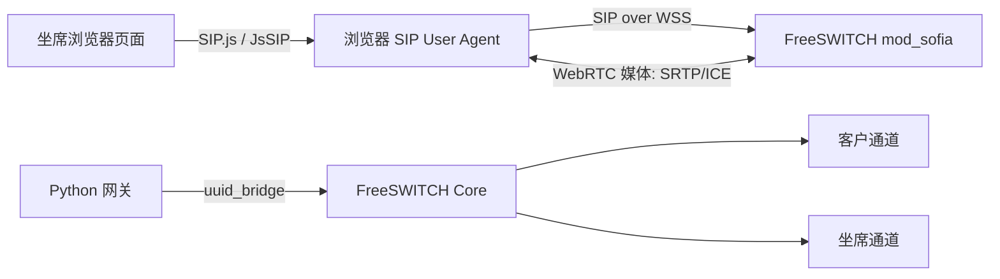
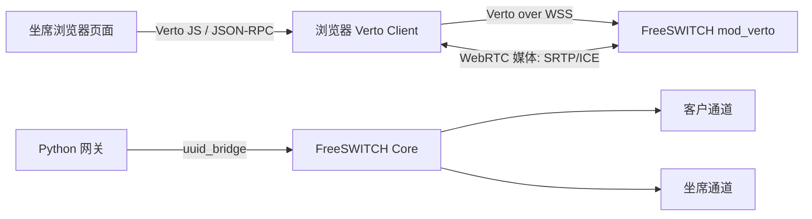

# WebRTC 坐席接入 FreeSWITCH 方案对比

## 1. 背景

当前物业费催收转人工方案需要让坐席在网页上点击“上线接听”，然后通过浏览器接听客户当前通话。

目标链路是：

```text
客户电话
-> FreeSWITCH 客户通道
-> 客户要求转人工
-> 坐席浏览器接入 FreeSWITCH
-> FreeSWITCH bridge 客户通道和坐席通道
-> 人工继续对话
```

这里的关键问题是：坐席浏览器如何接入 FreeSWITCH。

候选方案有两种：

```text
方案 A：SIP over WSS
方案 B：mod_verto
```

两种方案都能让浏览器通过 WebRTC 和 FreeSWITCH 建立音频通道。差异主要在“信令协议”和“生态兼容性”。

## 2. 先解释几个概念

### 2.1 WebRTC

WebRTC 是浏览器里的实时音视频能力。

它解决的是：

```text
浏览器如何采集麦克风
浏览器如何播放远端声音
浏览器如何和服务器建立实时音频媒体通道
浏览器如何处理回声消除、丢包、抖动、NAT 穿透
```

但 WebRTC 本身不规定业务信令怎么写。浏览器要先通过某种信令协议告诉服务器：

```text
我要注册
我要呼叫
我接听了
我要挂断
我的 SDP 是什么
我的 ICE candidate 是什么
```

`SIP over WSS` 和 `mod_verto` 的区别，就在这一层信令协议。

### 2.2 WSS

`WSS` 是加密版 WebSocket。

浏览器里的 WebRTC 坐席通常需要 HTTPS 页面和 WSS 信令。

原因：

```text
1. 浏览器麦克风权限通常要求 HTTPS。
2. 生产环境不能用不可信证书。
3. WebRTC 信令中会交换 SDP、ICE、媒体参数，必须走可信通道。
```

### 2.3 STUN / TURN

STUN / TURN 用来解决网络穿透。

```text
STUN：帮助浏览器发现自己的公网映射地址。
TURN：当浏览器和 FreeSWITCH 不能直连时，提供音频中继。
```

无论选 `SIP over WSS` 还是 `mod_verto`，商用都要准备 STUN/TURN，常见开源实现是 `coturn`。

## 3. 方案 A：SIP over WSS

### 3.1 它是什么

`SIP over WSS` 的意思是：

```text
浏览器使用 SIP 协议做电话信令。
SIP 消息通过加密 WebSocket，也就是 WSS，发给 FreeSWITCH。
媒体仍然使用 WebRTC。
```

浏览器侧通常使用：

```text
SIP.js
JsSIP
```

FreeSWITCH 侧通常使用：

```text
mod_sofia
```

坐席浏览器在系统里更像一个“网页 SIP 分机”。

### 3.2 通话链路



坐席上线时：

```text
1. 坐席打开页面。
2. 点击“上线接听”。
3. 浏览器申请麦克风权限。
4. SIP.js / JsSIP 通过 WSS 注册到 FreeSWITCH。
5. 坐席状态变成 available。
```

坐席接听时：

```text
1. 页面调用 POST /calls/{call_id}/handoff/claim。
2. Python 网关确认坐席 available。
3. Python 网关拿到坐席对应的 FreeSWITCH channel UUID。
4. 执行 uuid_bridge <customer_channel_uuid> <agent_uuid>。
5. 客户和坐席开始人工通话。
```

### 3.3 优点

```text
1. 更接近传统电话系统模型
   坐席就是 SIP 分机，后续接软电话、SBC、第三方呼叫中心更自然。

2. 生态更通用
   SIP 是电话系统常见协议，团队以后排障、扩展、对接外部系统时更容易找到资料和经验。

3. 坐席身份模型清晰
   坐席可以有 extension、register、online、busy、unregister 等状态。

4. 未来兼容性更好
   如果以后要支持软电话兜底、实体 SIP 电话、呼叫中心平台，SIP over WSS 的迁移成本更低。

5. 和 FreeSWITCH 电话能力结合更自然
   bridge、transfer、hold、record、DTMF、presence 等能力更容易按电话系统思路组织。
```

### 3.4 缺点

```text
1. SIP 概念比较多
   REGISTER、INVITE、ACK、BYE、SDP、Contact、Via、NAT、401 鉴权等都需要理解。

2. 前端接入复杂度略高
   需要选择 SIP.js 或 JsSIP，并处理注册、重连、来电、挂断、媒体设备、异常状态。

3. FreeSWITCH 配置要求更完整
   需要确认 mod_sofia 的 WebSocket/WSS、TLS 证书、profile、ACL、codec、NAT 配置。

4. 排障链路较长
   问题可能出在浏览器、SIP.js/JsSIP、WSS、SIP 注册、SDP、ICE、RTP、FreeSWITCH profile。
```

### 3.5 适合什么场景

```text
1. 最终目标是商用坐席系统。
2. 后续可能兼容 SIP 软电话或实体话机。
3. 后续可能对接 SBC、呼叫中心、第三方电话系统。
4. 需要多坐席、忙闲、排队、转接、录音、质检、统计。
5. 团队愿意按标准电话系统方式建设和排障。
```

## 4. 方案 B：mod_verto

### 4.1 它是什么

`mod_verto` 是 FreeSWITCH 提供的 WebRTC 接入模块。

它的思路是：

```text
浏览器不伪装成 SIP 分机。
浏览器使用 Verto 协议和 FreeSWITCH 通信。
Verto 信令一般通过 WebSocket / WSS 传输。
媒体仍然使用 WebRTC。
```

坐席浏览器在系统里更像一个“FreeSWITCH 原生 WebRTC 客户端”。

### 4.2 通话链路



坐席上线时：

```text
1. 坐席打开页面。
2. 点击“上线接听”。
3. 浏览器申请麦克风权限。
4. Verto 客户端通过 WSS 连接 FreeSWITCH mod_verto。
5. 坐席状态变成 available。
```

坐席接听时：

```text
1. 页面调用 POST /calls/{call_id}/handoff/claim。
2. Python 网关确认坐席 available。
3. Python 网关拿到 Verto 坐席通道 UUID。
4. 执行 uuid_bridge <customer_channel_uuid> <agent_uuid>。
5. 客户和坐席开始人工通话。
```

### 4.3 优点

```text
1. FreeSWITCH 原生 WebRTC 路线
   浏览器直接接入 FreeSWITCH 的 Verto 能力，不需要把浏览器建模成 SIP 分机。

2. 概念上更贴近网页 WebRTC
   前端不需要处理完整 SIP 协议细节。

3. 做 WebRTC PoC 可能更快
   如果团队只想先验证“浏览器能否和 FreeSWITCH bridge 成功”，Verto 可能更直接。

4. 和 FreeSWITCH 内部能力结合紧密
   Verto 是 FreeSWITCH 自己的 WebRTC 接入方式，通道最终仍然可以被 FreeSWITCH 管理和 bridge。
```

### 4.4 缺点

```text
1. 生态更窄
   Verto 是 FreeSWITCH 体系内的协议，不像 SIP 那样被各种电话系统广泛支持。

2. 后续对接外部电话系统时迁移成本更高
   如果将来要接 SIP 软电话、实体 SIP 电话、SBC、第三方呼叫中心，仍然要回到 SIP 体系。

3. 前端可选库和资料相对少
   团队遇到浏览器兼容、重连、媒体设备、异常恢复问题时，可参考资料相对少。

4. 容易形成 FreeSWITCH 绑定
   如果未来媒体/电话底座从 FreeSWITCH 换成别的系统，Verto 方案迁移成本更高。
```

### 4.5 适合什么场景

```text
1. 团队只使用 FreeSWITCH，不计划对接其他电话系统。
2. 第一目标是快速验证浏览器 WebRTC 和 FreeSWITCH bridge。
3. 团队熟悉 mod_verto，或者已有 Verto 客户端经验。
4. 系统不需要兼容 SIP 软电话、实体话机、外部呼叫中心。
```

## 5. 两种方案共同需要解决的问题

无论选择哪种，以下问题都绕不开：

```text
1. HTTPS 页面
   浏览器麦克风权限需要可信 HTTPS。当前业务页面域名 https://recov.lingchen-ai.com/ 可访问，但它当前不是 111.229.146.182 这台 FreeSWITCH 服务器的入口。

2. WSS 信令
   浏览器到 FreeSWITCH 的信令需要走安全 WebSocket。线上 FreeSWITCH 容器内部已有 5066/7443 配置基础，但公网还没有暴露或反代到这些端口。

3. 证书
   页面证书可用不等于 FreeSWITCH WSS 证书可用。当前 FreeSWITCH WSS 证书是 CN=FreeSWITCH 的自签名证书，浏览器不可直接信任。

4. STUN / TURN
   坐席浏览器和 FreeSWITCH 不一定能直接建立媒体连接，需要准备 TURN。

5. NAT 和防火墙
   FreeSWITCH 的公网 IP、RTP 端口段、WebSocket 端口、TURN relay 端口都要明确。

6. 麦克风权限和设备选择
   页面要处理授权、拒绝授权、设备切换、无麦克风、浏览器刷新、断线重连。

7. 坐席状态
   坐席必须先 available，再允许 claim 某一通电话。

8. FreeSWITCH bridge 验证
   必须验证 uuid_exists <customer_channel_uuid> 和 uuid_bridge <customer_channel_uuid> <agent_uuid>。
```

## 6. 线上环境只读验证结果

验证时间：2026-05-29。验证对象：`111.229.146.182`。

| 检查项 | 结果 | 判断 |
|---|---|---|
| FreeSWITCH 运行方式 | Docker 容器 `sip_realtime_freeswitch` | 端口能力要看容器映射和反代 |
| `mod_sofia` | 已加载 | SIP over WSS 有模块基础 |
| internal profile | 已有 `ws-binding :5066`、`wss-binding :7443` | 容器内部有 WebSocket/WebRTC 配置基础 |
| Docker 暴露端口 | 未暴露 `5066`、`7443` | 公网浏览器当前连不到 SIP WSS |
| Caddy 配置 | 未发现 `recov.lingchen-ai.com` 到 FreeSWITCH WSS 的反代 | 需要新增 WSS 入口 |
| 域名解析 | `recov.lingchen-ai.com` 在服务器上解析到 `81.68.166.109`，不是 `111.229.146.182` | 坐席 WSS 需要独立明确域名 |
| WSS 证书 | FreeSWITCH `wss.pem` 是自签名 `CN=FreeSWITCH`，无 SAN | 浏览器不可直接商用 |
| `mod_opus` | 已加载 | 有 Opus 模块基础 |
| internal codec | 当前 `global_codec_prefs=PCMA,PCMU` | 需要 PoC 验证浏览器 SDP/codec 协商，必要时加入 Opus |
| `mod_verto` | 已加载，但 8081/8082 未暴露 | 可备选验证，但当前也未公网可用 |
| TURN | 未发现 3478/5349 入口 | 商用仍需准备 coturn |

结论：

```text
线上环境不是“完全没有基础”，而是“FreeSWITCH 内部基础有了，公网浏览器接入条件还没补齐”。

SIP over WSS 的下一步不是换方案，而是做一个最小连通 PoC：
1. 准备坐席 WSS 域名，例如 wss.recov.lingchen-ai.com。
2. 将域名解析或反代到 111.229.146.182。
3. 为 FreeSWITCH WSS 使用可信证书。
4. 暴露或反代 WSS 到容器 7443。
5. 验证浏览器 SIP.js/JsSIP 注册、呼入、双向音频和 uuid_bridge。
6. 增加 coturn 后在复杂 NAT 网络复测。
```

## 7. 对当前项目的影响

### 7.1 对前端的影响

| 项目 | SIP over WSS | mod_verto |
|---|---|---|
| 前端库 | SIP.js 或 JsSIP | Verto 客户端 |
| 坐席模型 | SIP 分机 / Web SIP UA | Verto 客户端 |
| 注册动作 | SIP REGISTER | Verto login/connect |
| 接听动作 | SIP 呼叫/通道建立后 bridge | Verto 通道建立后 bridge |
| 前端复杂度 | SIP 状态多，学习成本高 | SIP 概念少，但资料更窄 |

### 7.2 对 FreeSWITCH 的影响

| 项目 | SIP over WSS | mod_verto |
|---|---|---|
| 主要模块 | mod_sofia | mod_verto |
| 配置重点 | SIP profile、WSS、TLS、注册、ACL、codec、NAT | Verto profile、WSS、TLS、codec、NAT |
| 外部兼容 | 更通用 | 更偏 FreeSWITCH 内部 |
| 和 SIP 生态关系 | 强 | 弱 |

### 7.3 对 Python 网关的影响

上层接口基本不变：

```text
坐席上线
-> available
-> POST /calls/{call_id}/handoff/claim
-> 后端获得 agent_uuid
-> uuid_bridge customer_channel_uuid agent_uuid
```

差异在于 agent_uuid 怎么来：

```text
SIP over WSS：
  agent_uuid 来自 SIP/WebRTC 分机对应的 FreeSWITCH channel。

mod_verto：
  agent_uuid 来自 Verto 客户端对应的 FreeSWITCH channel。
```

Python 网关应该尽量抽象成：

```text
AgentMediaAdapter
  register / online
  get_agent_channel_uuid
  bridge_to_customer
  hangup_agent
  mark_available / mark_busy
```

不要让业务层直接依赖 SIP.js、JsSIP 或 Verto 的细节。

## 8. 商用角度对比

| 维度 | SIP over WSS | mod_verto |
|---|---|---|
| 商用通用性 | 更强 | 较弱 |
| 电话系统兼容性 | 更好 | 偏 FreeSWITCH |
| 学习成本 | SIP 概念多 | Verto 资料少 |
| 快速 PoC | 中等 | 可能更快 |
| 后续接软电话 | 自然 | 需要额外 SIP 路线 |
| 后续接实体话机 | 自然 | 需要额外 SIP 路线 |
| 后续接呼叫中心/SBC | 更自然 | 迁移成本较高 |
| 前端生态 | SIP.js/JsSIP 资料较多 | Verto 生态较窄 |
| FreeSWITCH 绑定 | 中等 | 更强 |
| 推荐定位 | 商用主路线 | PoC/备选路线 |

## 9. 推荐结论

结合当前业务，本轮已确认第一版采用：

```text
主路线：SIP over WSS + SIP.js/JsSIP + FreeSWITCH mod_sofia
备选路线：mod_verto
```

原因：

```text
1. 当前不是单纯网页语音 Demo，而是物业催收坐席系统。
2. 后续大概率需要坐席账号、在线状态、忙闲、排队、录音、质检、统计。
3. 未来可能需要软电话兜底、SIP 设备、SBC 或第三方呼叫中心。
4. SIP over WSS 更接近电话系统标准模型，长期商用风险更低。
5. mod_verto 可以保留为快速验证浏览器 WebRTC 接入 FreeSWITCH 的备选。
```

## 10. 建议 PoC 验收标准

不管选哪种，PoC 不应只验证“页面能连接”。

必须验证：

```text
1. 坐席点击上线后，浏览器完成麦克风授权。
2. 坐席状态变为 available。
3. FreeSWITCH 中能看到坐席对应 channel。
4. 客户通道 uuid_exists 成功。
5. 坐席通道 uuid_exists 成功。
6. uuid_bridge customer_channel_uuid agent_uuid 成功。
7. 客户能听到坐席。
8. 坐席能听到客户。
9. 挂断任一方后，双方状态正确释放。
10. 浏览器刷新、断网、拒绝麦克风时，坐席状态不会误判为 available。
11. NAT 网络下能通话；不能直连时 TURN 生效。
```

## 11. 需要落地确认的问题

```text
1. 坐席 WSS 使用哪个域名，例如 wss.recov.lingchen-ai.com，是否指向或反代到 111.229.146.182。
2. Docker 是直接暴露 7443，还是通过 Caddy/Nginx 反代到容器 7443。
3. FreeSWITCH WSS 如何使用可信证书链，证书域名必须和浏览器连接域名一致。
4. internal profile 的 codec 是否加入 Opus，以及浏览器和 FreeSWITCH 的 SDP 是否能稳定协商。
5. coturn 部署在哪台机器，开放哪些端口，坐席外网接听是否必须走 TURN。
6. PoC 验证范围：注册成功、坐席呼入成功、双向音频成功、uuid_bridge 成功。
7. mod_verto 只作为备选 PoC，不进入第一版主方案。
```

## 12. 本项目建议

当前项目建议这样推进：

```text
1. 文档层先把两条路线都列为候选。
2. PoC 优先验证 SIP over WSS。
3. 如果 SIP over WSS 在证书、mod_sofia、浏览器兼容或团队经验上阻塞明显，再验证 mod_verto。
4. 上层产品流程保持不变：上线接听 -> available -> claim -> bridge。
5. 不要因为底层选型变化，反复修改业务接口和页面状态机。
```

最终验收不是“选了哪个协议”，而是：

```text
坐席能稳定上线，能接听指定通话，客户和坐席双向音频正常，异常状态可恢复，商用网络下可排障。
```

## 13. 参考资料

- [FreeSWITCH mod_sofia 官方文档](https://developer.signalwire.com/freeswitch/FreeSWITCH-Explained/Modules/mod_sofia_1048707)
- [FreeSWITCH mod_verto 官方文档](https://developer.signalwire.com/freeswitch/FreeSWITCH-Explained/Modules/mod_verto_3964934)
- [SIP.js 官方文档](https://sipjs.com/api/0.9.0/ua/)
- [JsSIP 官方网站](https://jssip.net/)
