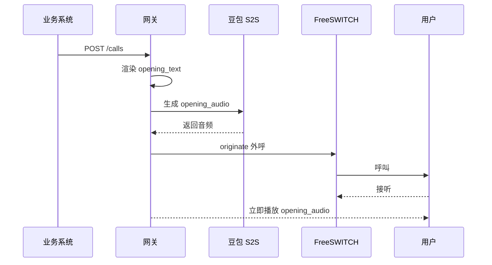

# 个性化开场白拨号前预生成说明

## 1. 目标

外呼接通后，用户应尽快听到带业务信息的开场白，避免实时模型现场生成第一句话造成接通后的空白等待。

本阶段只关注“拨号前预生成开场白音频”：

```text
业务系统提交外呼请求
  -> 传入号码和业务变量
  -> 网关渲染 opening_text
  -> 网关在拨号前生成 opening_audio
  -> opening_audio 准备成功后再发起外呼
  -> 用户接通后立即播放 opening_audio
```

## 2. 方案

采用“模板化文本 + 拨号前预生成音频”的方式。



不采用“接通后再生成开场白”，因为那会把模型首包延迟暴露给用户。

## 3. 请求数据

当前实现沿用本项目已有 `/calls` 字段风格，并在顶层增加 `opening` 对象。

```json
{
  "destination": "1000",
  "caller_id_number": "9000",
  "caller_id_name": "9000",
  "opening": {
    "voice": "female",
    "business": {
      "owner_name": "测试业主",
      "arrears_amount": "12.34"
    }
  }
}
```

字段说明：

```text
destination          被叫号码。
caller_id_number     主叫号码，沿用当前项目字段。
caller_id_name       主叫名称，必须使用 FreeSWITCH 支持的安全字符。
opening              可选；传入时启用拨号前个性化开场白。
opening.business     业务上下文，用于渲染开场白。
opening.voice        音色枚举，本阶段只支持 female / male。
```

不建议业务系统直接传供应商音色 ID。网关应把业务枚举映射为内部音色配置，避免业务侧传入未验证或无权限的音色。

## 4. 文本模板

网关根据业务变量渲染开场白文本。

示例模板：

```text
您好，请问是{owner_name}吗？系统显示您当前有{arrears_amount}元待缴费用，想和您确认一下。
```

渲染结果：

```text
您好，请问是测试业主吗？系统显示您当前有12.34元待缴费用，想和您确认一下。
```

模板渲染要求：

```text
1. 必填变量缺失时，不发起外呼，直接返回参数错误。
2. 金额、姓名等变量必须做长度和字符校验。
3. opening_text 应记录 hash，避免日志直接暴露完整业务敏感信息。
4. 不建议把真实业主姓名、金额写入普通运行日志。
```

## 5. 音频生成

当前已验证的生成方式是复用豆包 S2S 实时语音 WebSocket，通过文本输入生成开场白音频。

当前 demo 命令：

```powershell
python -m app.doubao_s2s_probe `
  --env-file .env `
  --text "请严格朗读以下开场白，不要添加、删减或改写：您好，请问是测试业主吗？系统显示您当前有12.34元待缴费用，想和您确认一下。" `
  --timeout-seconds 60
```

已验证结果：

```text
status=ok
audio_supported=true
output_sample_rate=24000
first_audio_delta_ms=609
response_done_ms=2578
```

注意：

```text
1. user-text 包装指令已验证可以返回音频。
2. 直接 TTS_TEXT 事件当前未验证通过，返回 DialogAudioIdleTimeoutError。
3. 本阶段不再设计其他备选生成链路。
4. 当前实现超时时间为 60 秒；业务系统和上游 HTTP 代理超时应大于 60 秒。
```

## 6. 音色选择

本阶段只使用官方内置音色，并由网关做白名单映射。

```text
voice=female -> zh_female_vv_jupiter_bigtts
voice=male   -> zh_male_yunzhou_jupiter_bigtts
```

已完成的本地探测：

```text
female:
  model=O2.0
  speaker=zh_female_vv_jupiter_bigtts
  status=ok
  first_audio_delta_ms=594
  response_done_ms=1297

male:
  model=O2.0
  speaker=zh_male_yunzhou_jupiter_bigtts
  status=ok
  first_audio_delta_ms=625
  response_done_ms=1531
```

## 7. 失败策略

开场白必须在拨号前生成完成。

```text
生成成功：
  保存本次通话临时 opening_audio。
  再发起外呼。

生成失败：
  不发起外呼。
  返回 opening_generation_failed。

生成超时：
  不发起外呼。
  返回 opening_generation_timeout。
```

当前 HTTP 映射：

```text
参数错误：400
生成失败：502 opening_generation_failed
生成超时：504 opening_generation_timeout
生成能力不可用：503 opening generation is unavailable
```

这样可以避免用户已经接通后还在等待开场白生成。

本阶段不做缓存，也不做降级音频：

```text
1. 开场白包含业主名称、小区名称、金额等强业务变量，复用缓存命中率低。
2. 使用通用降级音频会丢失本次业务信息，容易造成用户听感和业务语义不一致。
3. 只要坚持“音频未生成成功就不拨号”，就不会出现接通后冷场问题。
4. 失败直接返回给业务系统更可控，业务系统可以稍后重试或转人工流程。
5. 不做缓存可以减少敏感音频落盘、过期清理和隐私合规复杂度。
```

## 8. 产物和清理

opening_audio 是本次通话临时产物。

```text
1. 只在当前通话生命周期内使用，当前实现放在网关进程内存中。
2. 不做长期个性化音频缓存，也不保留通用降级音频。
3. 通话接通进入媒体链路后取出使用；通话失败、挂断或记录裁剪时清理临时音频。
4. 如果需要排障，只保留 hash、耗时、字节数、采样率和错误码。
5. 网关进程重启会丢失尚未接通使用的 opening_audio，本阶段接受该限制。
```

## 9. 播放和打断

接通后媒体 WebSocket 建立时，网关先播放本次 `opening_audio`，然后继续正常实时语音对话。

```text
1. opening_audio 会预先转换为电话侧 8k/20ms PCM 帧。
2. 播放期间如果用户开始说话，网关允许打断开场白。
3. 打断时清空当前开场白播放队列，并按现有插话修复流程进入实时对话。
4. 完整 opening_text 会注入豆包实时会话上下文，帮助模型理解用户的“是的 / 不是 / 已经交了”等简短回复。
5. opening_text 不写入普通运行日志；日志和接口返回只保留 hash、耗时、字节数、采样率和音色等元数据。
```

## 10. 观测指标

建议记录：

```text
opening_text_hash
opening_audio_status
opening_generation_ms
opening_audio_bytes
opening_audio_sample_rate
opening_generation_error
call_started_after_opening_ready
opening_playback_interrupted
```

这些指标用于判断：

```text
1. 是否真的做到拨号前音频已准备好。
2. 生成耗时是否稳定。
3. 失败是否在拨号前被拦截。
4. 是否存在异常大音频或空音频。
5. 用户是否在开场白播放期间打断。
```

## 11. 验收标准

```text
1. 外呼请求带业务变量时，能渲染出正确 opening_text。
2. opening_audio 生成成功后才发起外呼。
3. opening_audio 生成失败时不发起外呼。
4. 用户接通后能立即听到开场白。
5. male / female 两种音色都能通过参数选择。
6. 日志不直接输出完整敏感业务文本。
7. 用户在开场白播放期间说话时，可以打断并进入实时对话。
```
